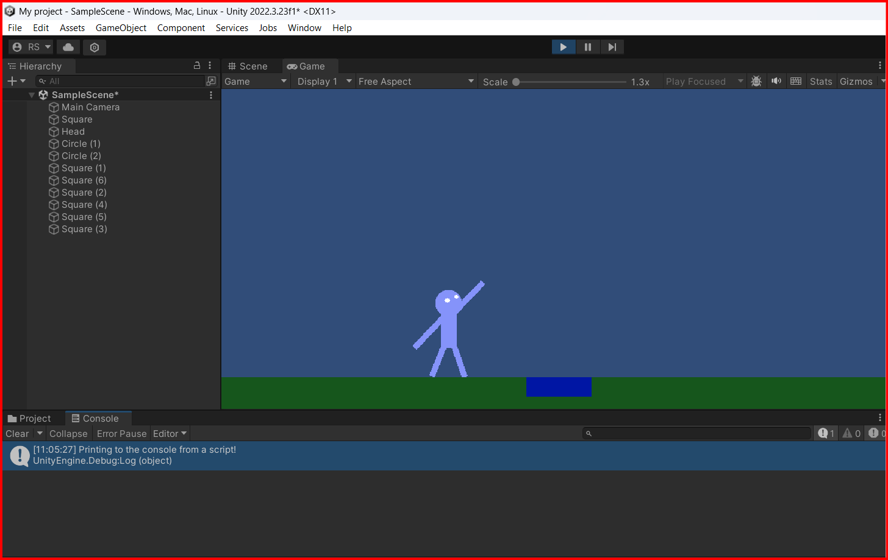
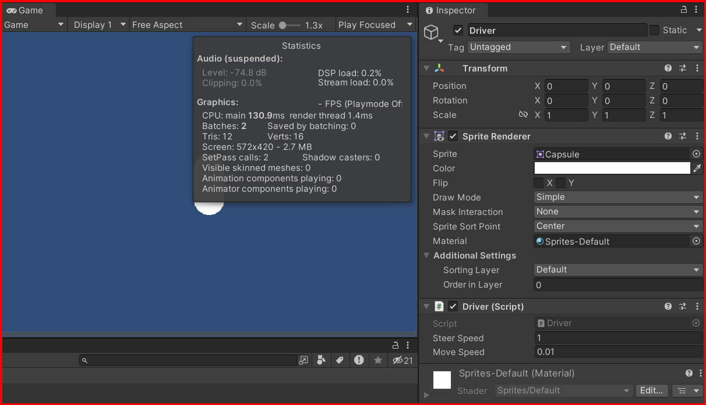

# Coding in Unity

As mentioned in the previous section, Unity uses `C#` as the scripting language. In this section, we will learn how to create a script and add it to an object.

## Creating a script

To create a script, right click in the project window and select `create` -> `C# script`. `Name` the script and double click to open it in visual studio code.
```csharp

using System.Collections;
using System.Collections.Generic;
using UnityEngine;

public class PrintToConole : MonoBehaviour
{
    // Start is called before the first frame update
    void Start()
    {
         Debug.Log("Printing to the console from a script!");   
  
    }

    // Update is called once per frame
    void Update()
    {
        
    }
}

```

### Adding a script to an object

To add a script to an object, drag the script from the project window to the object in the hierarchy window or select the object in the hierarchy window and click on `add component` in the inspector window and search for the script.

run the game and you will see the message in the console window.\



### Script Initial methods

- `Start()` method is called before the first frame update. This method is called only once when the script is loaded.
- `Update()` method is called once per frame. This method is called every frame.


## Variables in Unity

Variable are used to store data in a program. In Unity, variables can be declared in the script and can be accessed in the inspector window.
variables can be of different types like `int`, `float`, `double`, `string`, `bool`, etc.

- `int` - integer value
- `float` - floating point value(up to 6 decimal places)
- `double` - floating point value(up to 15 decimal places)
- `bool` - boolean value(true or false)
- `string` - sequence of characters, like a word or a sentence

Examples:

```csharp
float speed = 3.8f;
bool isAlive = true;
string myName = "Rene";
```

### Accessing variables in the inspector window

To access the variables in the inspector window, before the variable, put the `[SerializeField]` attribute. This will make the variable visible in the inspector window.

```csharp
public class Driver : MonoBehaviour
{

    [SerializeField] float steerSpeed = 1;
    [SerializeField] float moveSpeed = 0.01f;

    // Start is called before the first frame update
    void Start()
    {
        transform.Translate(6.19f, 0, 0);
    }

    // Update is called once per frame
    void Update()
    {
        transform.Rotate(0, 0, steerSpeed);
        transform.Translate(0, moveSpeed, 0);

    }
}

```



- `steerSpeed` and `moveSpeed` are the variables that can be accessed in the inspector window.\
you can use `public` instead of `[SerializeField]` but it is only recommended if you want to access the variable from another script.

## Methods in Unity

Unity provides many built-in methods that can be used to interact with the game objects. Some of the commonly used methods are:

- `Start()`: This method is called before the first frame update. This method is called only once when the script is loaded.
- `Update()`: This method is called once per frame. This method is called every frame.
- `LateUpdate()`: This method is called after all the `Update()` methods have been called.
- `FixedUpdate()`: This method is called at a fixed interval. This method is called every fixed frame rate frame.
- [`OnCollisionEnter()`](./OnCollisionEnter.md): This method is called when the object collides with another object.
- [`OnTriggerEnter()`](./OnTriggerEnter.md): This method is called when the object enters a trigger collider.
- `OnMouseDown()`: This method is called when the object is clicked on with the mouse.
- `OnMouseEnter()`: This method is called when the mouse enters the object's collider.
- `OnMouseExit()`: This method is called when the mouse exits the object's collider.
- `OnMouseOver()`: This method is called when the mouse is over the object's collider.
- `OnMouseUp()`: This method is called when the mouse button is released over the object.
- `OnMouseUpAsButton()`: This method is called when the mouse button is released over the object as a button.
- `OnDestroy()`: This method is called when the object is destroyed.
- `OnDisable()`: This method is called when the object is disabled.
- `OnEnable()`: This method is called when the object is enabled.
- `OnGUI()`: This method is called for rendering and handling GUI events.
- `OnTriggerExit()`: This method is called when the object exits a trigger collider.
- `OnTriggerStay()`: This method is called when the object stays in a trigger collider.
- `OnTriggerExit2D()`: This method is called when the object exits a 2D trigger collider.
- `OnTriggerStay2D()`: This method is called when the object stays in a 2D trigger collider.
- `OnCollisionExit()`: This method is called when the object exits a collision with another object.
- `OnCollisionStay()`: This method is called when the object stays in a collision with another object.
- `OnCollisionExit2D()`: This method is called when the object exits a 2D collision with another object.
- `OnCollisionStay2D()`: This method is called when the object stays in a 2D collision with another object.
- `OnApplicationFocus()`: This method is called when the application gains or loses focus.
- `OnApplicationPause()`: This method is called when the application is paused or resumed.
- `OnApplicationQuit()`: This method is called when the application is quit.
- `OnBecameInvisible()`: This method is called when the object becomes invisible.
- `OnBecameVisible()`: This method is called when the object becomes visible.
- `OnDrawGizmos()`: This method is called for drawing gizmos in the scene view.
- `OnDrawGizmosSelected()`: This method is called for drawing gizmos in the scene view only if the object is selected. 

**To se how collision and rigid bodies work, take a look [here](./colliders_rigdbody.md)**

## Transform Methods

Unity provides many built-in methods that can be used to manipulate the transform component of the object. Some of the commonly used methods are:

- [`Rotate()`](./method-rotate.md): This method is used to rotate the object around the specified axis.
- [`Translate()`](./method-translate.md): This method is used to move the object in the specified direction.
- `LookAt()`: This method is used to make the object look at the specified target.
- `Scale()`: This method is used to scale the object by the specified amount.
- `TransformDirection()`: This method is used to transform a direction from local space to world space.
- `TransformPoint()`: This method is used to transform a point from local space to world space.
- `TransformVector()`: This method is used to transform a vector from local space to world space.
- `InverseTransformDirection()`: This method is used to transform a direction from world space to local space.
- `InverseTransformPoint()`: This method is used to transform a point from world space to local space.
- `InverseTransformVector()`: This method is used to transform a vector from world space to local space.

## Capturing Input

Unity provides many built-in methods that can be used to capture input from the user. Some of the commonly used methods are:

- `Input.GetKey()`: This method is used to get the key input from the user.
- `Input.GetKeyDown()`: This method is used to get the key input from the user when the key is pressed.
- `Input.GetKeyUp()`: This method is used to get the key input from the user when the key is released.
- `Input.GetMouseButton()`: This method is used to get the mouse button input from the user.
- `Input.GetMouseButtonDown()`: This method is used to get the mouse button input from the user when the button is pressed.
- `Input.GetMouseButtonUp()`: This method is used to get the mouse button input from the user when the button is released.
- [`Input.GetAxis()`](./input.GetAxis.md): This method is used to get the axis input from the user.
- `Input.GetAxisRaw()`: This method is used to get the raw axis input from the user.
- `Input.GetButton()`: This method is used to get the button input from the user.
- `Input.GetButtonDown()`: This method is used to get the button input from the user when the button is pressed.
- `Input.GetButtonUp()`: This method is used to get the button input from the user when the button is released.
- `Input.GetJoystickNames()`: This method is used to get the names of the joysticks connected to the system.


## Using Time in Unity

Unity provides many built-in methods that can be used to get the time in the game. Some of the commonly used methods are:

- [`Time.deltaTime`](./Time.deltaTime.md): This method is used to get the time taken to complete the last frame.
- `Time.fixedDeltaTime`: This method is used to get the fixed time interval between frames.
- `Time.fixedTime`: This method is used to get the fixed time since the start of the game.
- `Time.frameCount`: This method is used to get the number of frames that have passed since the start of the game.
- `Time.realtimeSinceStartup`: This method is used to get the real time since the start of the game.
- `Time.smoothDeltaTime`: This method is used to get the smoothed time taken to complete the last frame.
- `Time.time`: This method is used to get the time since the start of the game.
- `Time.timeScale`: This method is used to get the time scale of the game.
- `Time.timeSinceLevelLoad`: This method is used to get the time since the level was loaded.
- `Time.unscaledDeltaTime`: This method is used to get the unscaled time taken to complete the last frame.
- `Time.unscaledTime`: This method is used to get the unscaled time since the start of the game.
- `Time.captureFramerate`: This method is used to get or set the frame rate at which the game is running.
- `Time.maximumDeltaTime`: This method is used to get or set the maximum time interval between frames.
- `Time.maximumParticleDeltaTime`: This method is used to get or set the maximum time interval between particles.
- `Time.maximumParticleDeltaTime`: This method is used to get or set the maximum time interval between particles.


## Creating a reference to another object in Unity Inspector

To create a reference to another object, you can use the `GameObject` class. This class is used to represent a game object in Unity. You can create a reference to another object by declaring a variable of type `GameObject` and assigning the object to the variable.

```csharp

public class FollowObject : MonoBehaviour
{
    [SerializeField] GameObject target; // reference to the target object that you can assign in the inspector window

    // Update is called once per frame
    void Update()
    {
        transform.position = target.transform.position;
    }
}
```

## Object Methods

Unity provides many built-in methods that can be used to interact with the game objects. Some of the commonly used methods are:

- [`Destroy()`](./Object.destroy.md): This method is used to destroy the object.
- `Instantiate()`: This method is used to create a new instance of the object.
- `SetActive()`: This method is used to set the active state of the object.
- [`CompareTag()`](./Object.CompareTag.md): This method is used to compare the tag of the object.
- `SendMessage()`: This method is used to send a message to the object.
- `BroadcastMessage()`: This method is used to broadcast a message to the object.
- [`GetComponent()`](./Object.GetComponent.md): This method is used to get the component of the object.
- `GetComponentInChildren()`: This method is used to get the component of the object and its children.
- `GetComponentInParent()`: This method is used to get the component of the object and its parent.
- `GetComponents()`: This method is used to get all the components of the object.

&larr; [Back to Begin](./readme.md)