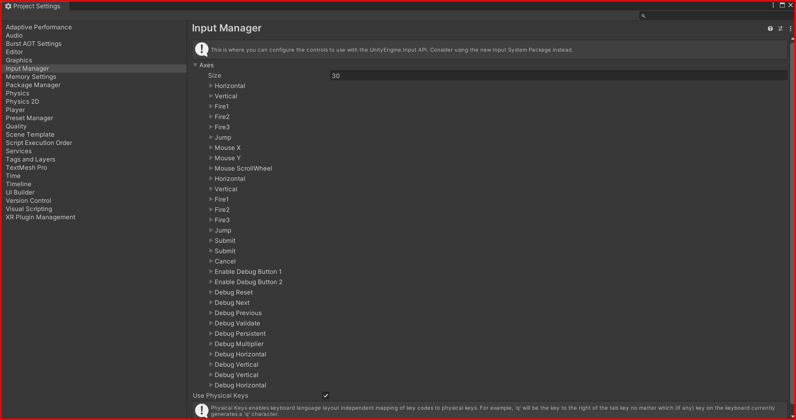

# Input System

The input system in Unity is used to get input from the user. The input can be from the keyboard, mouse, or any other input device. The input system is used to get the input from the user and perform actions based on the input.

you can find the input system in the `Edit -> Project Settings -> Input Manager` in the unity editor.

## Input Manager

The input manager is used to manage the input from the user. You can add new input axes, buttons, and keys in the input manager. You can also change the sensitivity of the input axes, buttons, and keys.

To add a new input axis, click on the `Add Axis` button in the input manager window. You can add a new axis by changing the name, description, and sensitivity of the axis.