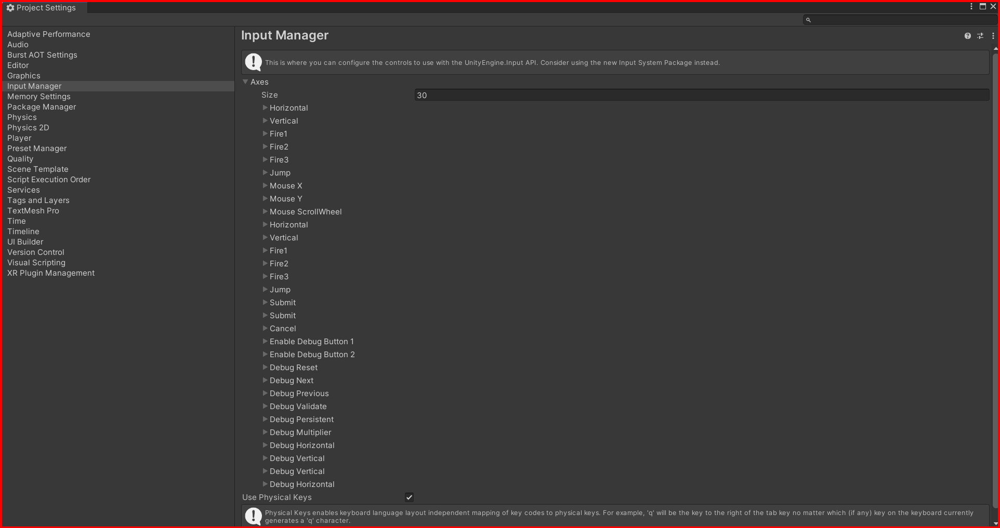
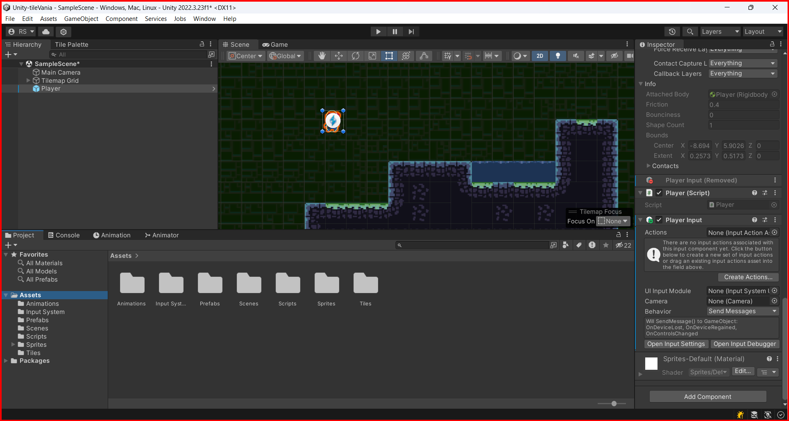
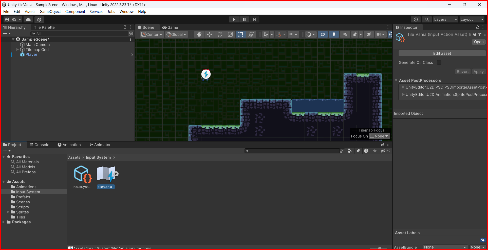
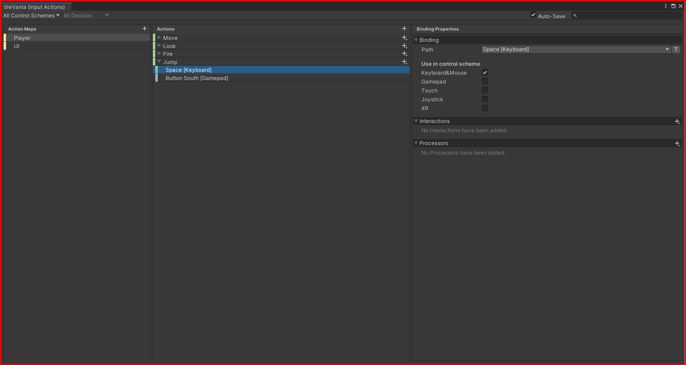
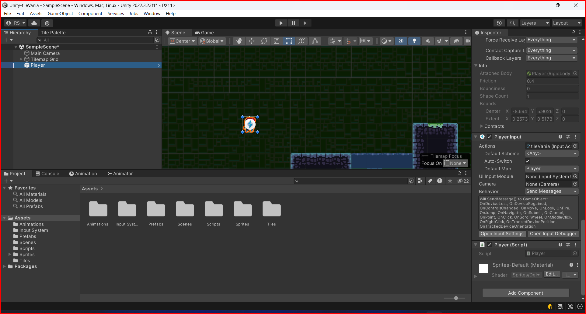
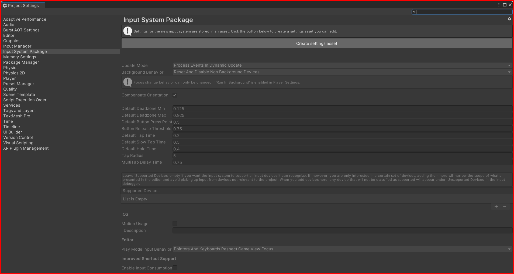

# Input System

The input system in Unity is used to get input from the user. The input can be from the keyboard, mouse, or any other input device. The input system is used to get the input from the user and perform actions based on the input.

you can find the input system in the `Edit -> Project Settings -> Input Manager` in the unity editor.

## Input Manager

The input manager is used to manage the input from the user. You can add new input axes, buttons, and keys in the input manager. You can also change the sensitivity of the input axes, buttons, and keys.

To add a new input axis, click on the `Add Axis` button in the input manager window. You can add a new axis by changing the name, description, and sensitivity of the axis.

## New Input system 

Unity has a new input system that is more flexible and powerful than the old input system. The new input system is based on the `Input System Package` that you can install from the package manager.

To install the `Input System Package`, go to the `Window` menu, then select `Package Manager`. In the package manager window, search for the `Input System Package` and click on the `Install` button.

### Add the new input system to the player

To add the new input system to the player, you need to create a new `Player Input` component.

### Create a new input action assets

To create a new input action, go to the player input component and click on the `Actions` tab. In the actions tab, you can create a new input action by clicking on the `Create Actions` button.
select a folder to save the input action asset.

### Add input action
now you can create a new input action by double-clicking on the input action asset. In the input action asset, you can add new input bindings, actions, and interactions.

### Create a input system asset

Go to the player input component and click on the `Open input settings` button.

In the input settings window, you can create a new input system asset by clicking on the `Create settings assets` button.
then close the input settings window.

### Actions to Methods
Once you done the actions will be converted to methods that you can use in your scripts. For example, if you have a `Jump` action, you can call the `OnJump` method in your script to perform the jump action.

&larr; [Back to Begin](./readme.md)