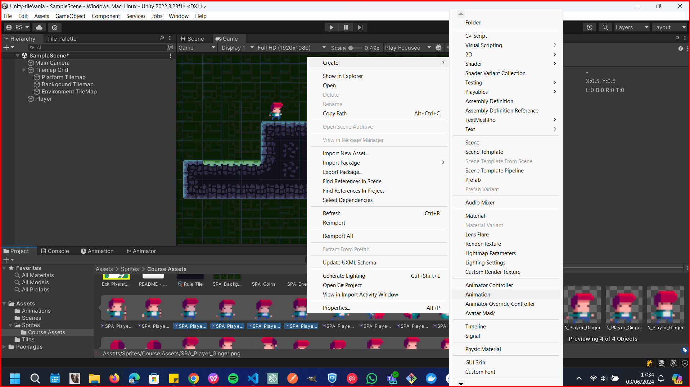

# Animation

In unity, you can animate objects in the scene. You can animate the position, rotation, and scale of the object. You can also animate the color of the object. You can animate the object in the scene view or in the game view. You can also animate the object in the timeline window.

## Animation Window

To open the animation window, click on the `Window` menu, then select `Animation`. You can also open the animation window by clicking on the `Animator` tab in the inspector window.

## Create Animation from the sprite sheet

Go to the sprite sheet and select the sprites that you want to animate. Then right-click and select `Create > Animation`. Then move the animation to the `Animations` folder or any folder that you want to store the animation. 

## Animator Controller

The `Animator Controller` is used to control the animation of the object. You can create an `Animator Controller` by right-clicking in the assets window and selecting `Create > Animator Controller`. You can also create an `Animator Controller` by clicking on the `Window` menu, then select `Animation` and then `Animator Controller`.

## Adding an Animatior Controller to the object

To add an animator controller to the object, select the object in the hierarchy window. Then add an `Animator` component to the object, by searching it in the component list. Then click on the `Controller` field in the `Animator` component and select the `Animator Controller` that you created.

## Adding an Animation to the Animator Controller

To add an animation to the `Animator Controller`, drag the animation to the `Animator Controller` window. You can also add an animation to the `Animator Controller` by clicking on the `Add Motion` button in the `Animator Controller` window.

## Adding the controller to the object

Add the created controller to the object by selecting the object in the hierarchy window and adding the `Animator` component to the object. Then click on the `Controller` field in the `Animator` component and select the `Animator Controller` that you created.

## Sumary of the steps to add an animation to an object

 1. First, Create a new folder in the assets window and name it `Animations`.
 2. Then add an `Animator Controller` to the folder. Right-click in the folder and select `Create > Animator Controller`.
 3. So, go to the `Sprite` folder ant select the sprites, in the spritesheet that you want to animate. then right-click and select `Create > Animation`. Then move the animation to the `Animations` folder.
 4. Select the object that you want to add the animation the hierarchy window. 
 5. Then add a `Animator` component to the object.
 6. At the ispector window, in the the `Animator` component, click on the `controller` field and select the `Animator Controller` that you created.
 7. Add The `Animation` to the `Animator Controller` by dragging the `Animation` to the `Animator Controller` window.
 8. Back to the Object, that have the `Animator` component, and add the  `Sprite Renderer` component, then select the `Sprite` property to point to any sprite representation of the animation.
 9. makesure the `Sprite renderer` at the `Aditional Setting` are pointing to the correct `Sorting Layer` and `Order in Layer`.
   

## Adding more states to the Animator Controller

You can add more states to the `Animator Controller` to assign diferent animations for diferent states of the object.

First, you will need do select the `Animator Controller` in the assets window. then click in the tab `Parameters` and click in the `Add` button.

for this example, we will add a `Bool` parameter to the `Animator Controller`. So, click in the `Add` button and select `Bool`. Then name the parameter as `isRunning`.

Drag the `Animation` to the `Animator Controller`.

Next we will need to define from which state the animation will start. Lets supose that this running animation will start from the `Idle` state. So, we will need to add a transition from the `Idle` state to the `Running` state and set the condition to the `isRunning` parameter to be `true`, and another transition from the `Running` state to the `Idle` state and set the condition to the `isRunning` parameter to be `false`.
To create a transition, right-click on the `Idle` state and select `Make Transition`, then click on the `Running` state. Then click on the transition line and set the condition to the `isRunning` parameter to be `true` at the inspector window.

&larr; [Back to Begin](./readme.md)