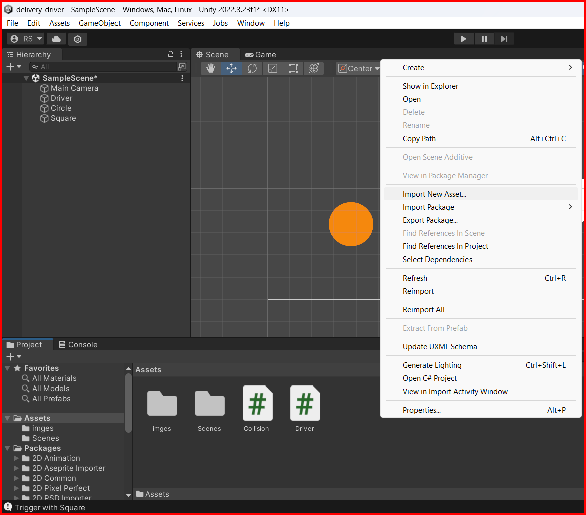
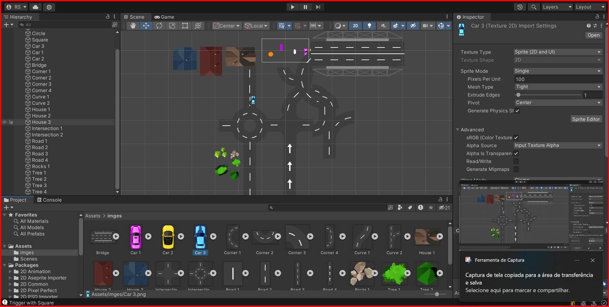
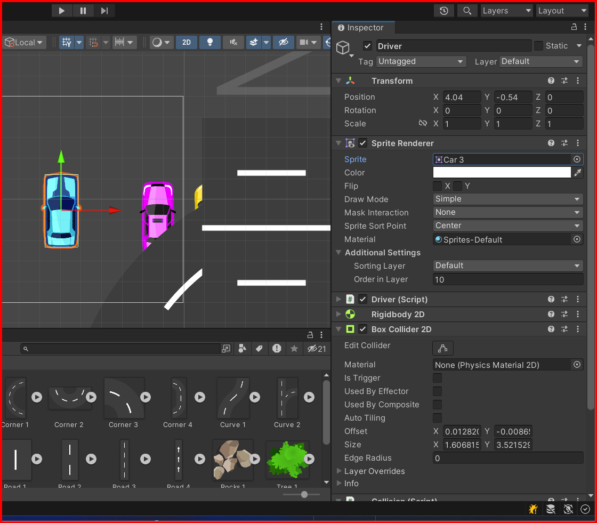

# Assets

## Adding assets to a project

Assets are the files that you import into your Unity project to create your game. These files can include 3D models, textures, audio files, scripts, and more. You can import assets into your project by `dragging and dropping` them into the Unity Editor, or by using the `Assets` menu in the Editor, or by right-clicking in the `Project` window and selecting `Import New Asset`.

When you import an asset into your project, Unity will create a copy of the asset and store it in the `Assets` folder of your project. You can organize your assets into folders within the `Assets` folder to keep your project organized.

## rezising assets to fit properly

In 2d games, Resolution refers to the number of `pixels` in a image.
Higher resolution images have more pixels.

### Unity unit

Unity uses a unit called `Unity unit` to measure the size of objects in the scene. it is a relative unit of measurement that is used to scale objects in the scene. This unit is represented by a `1x1x1` cube(3D) or `1x1` square(2D) in the scene view. 

**NOTE: to simplify the process of scaling objects in the scene, it is recommended to use the same scale for all objects in the scene.**

Lets assume that our unit is `1 unit = 1 meter`.

Insert every assets in to the scene and resize them to fit properly in the scene. You can resize all instances of an asset by its resolution in the `Inspector` window.
Firts, click on the asset in the `Project` window, then at the `Inspector` window, adjust the `pixels per unit` property to fit properly in the scene.

## Adding a sprite to a GameObject

To add a sprite to a GameObject, select the GameObject in the Hierarchy window, then in the Inspector window, click the at the `Sprite Renderer` component, then click on the `Sprite` field and select the sprite you want to add to the GameObject.

