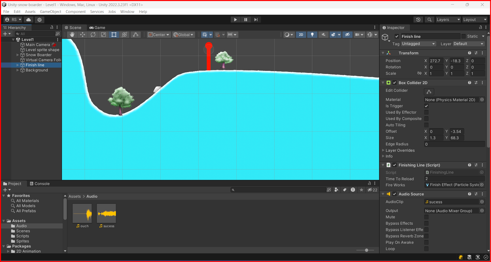

# Audio

In unity, you can add audio to your game. You can add audio to the scene or to the object. You can add audio to the scene by adding an audio source component to the scene

## Adding audio to a GameObject

To add an audio source component to a GameObject, select the GameObject in the hierarchy window, then click the `Add Component` button in the Inspector window. In the search bar, type `Audio Source`, then click on the `Audio Source` component in the search results. The audio source component will be added to the GameObject, and you can adjust its properties in the Inspector window.



## Playing audio in a script

To play audio in a script, you can use the `GetComponent` method to get the `AudioSource` component attached to the GameObject. You can then call the `Play` method on the `AudioSource` component to play the audio.

```csharp
using System.Collections;
using System.Collections.Generic;
using UnityEngine;
using UnityEngine.SceneManagement;

public class FinishingLine : MonoBehaviour
{
    Collider2D finishLine;
    [SerializeField] float timeToReload = 1f; // 1
    [SerializeField] ParticleSystem fireWorks;


    void Start() {
        finishLine = GetComponent<BoxCollider2D>();
    }
   void OnTriggerEnter2D(Collider2D other) {   
    AudioSource audioSource = GetComponent<AudioSource>();     
    bool isPlayer = other.CompareTag("Player");
    CircleCollider2D playerHead = other.GetComponent<CircleCollider2D>();
    bool isColidding = playerHead.IsTouching(finishLine);

        if(isPlayer && isColidding){
            audioSource.Play();
            fireWorks.Play();
            Invoke("ReloadScene", timeToReload);
        }
    }

    void ReloadScene(){
        SceneManager.LoadScene(0);
    }
}
```

In this example, the `Play` method is called on the `AudioSource` component to play the audio when the player collides with the finish line. The `fireWorks` particle system is also played when the player collides with the finish line. The `ReloadScene` method is called after `timeToReload` seconds have passed.

## Adding multiple audio clips to GameObject

You can add multiple audio clips to a GameObject by adding multiple `AudioSource` components to the GameObject. For this you will need to serialize an audio source for each audio clip you want to play.

```csharp
using System.Collections;
using System.Collections.Generic;
using UnityEngine;
using UnityEngine.SceneManagement;

public class FinishingLine : MonoBehaviour
{
    Collider2D finishLine;
    [SerializeField] float timeToReload = 1f; // 1
    [SerializeField] ParticleSystem fireWorks;
    [SerializeField] AudioSource audioSource1;
    [SerializeField] AudioSource audioSource2;

    void Start() {
        finishLine = GetComponent<BoxCollider2D>();
    }
   void OnTriggerEnter2D(Collider2D other) {   
    bool isPlayer = other.CompareTag("Player");
    CircleCollider2D playerHead = other.GetComponent<CircleCollider2D>();
    bool isColidding = playerHead.IsTouching(finishLine);

        if(isPlayer && isColidding){
            audioSource1.Play();
            audioSource2.Play();
            fireWorks.Play();
            Invoke("ReloadScene", timeToReload);
        }
    }

    void ReloadScene(){
        SceneManager.LoadScene(0);
    }
}
```

In this example, the `audioSource1` and `audioSource2` audio sources are played when the player collides with the finish line. The `fireWorks` particle system is also played when the player collides with the finish line. The `ReloadScene` method is called after `timeToReload` seconds have passed.

## Adding a audio that triggers on camera position

Let's take a sample where we hava a coin that triggers a sound when is picked up by the player. But the coin object is destroyed when the player picks it up. then in this case we can use `AudioSource.PlayClipAtPoint` method to play the audio clip at the position of the coin object.

```csharp
using System.Collections;
using System.Collections.Generic;
using UnityEngine;

public class Coin : MonoBehaviour
{
    [SerializeField] AudioClip CoinSound;
   void OnTriggerEnter2D(Collider2D other) {
    if(other.gameObject.layer == LayerMask.NameToLayer("Player")){
        FindObjectOfType<GameSession>().AddPlayerScore(10);
        AudioSource.PlayClipAtPoint(CoinSound, Camera.main.transform.position); // Play the sound at the camera position
        Destroy(gameObject);
    }
   }
}
```
&larr; [Back to Begin](./readme.md)