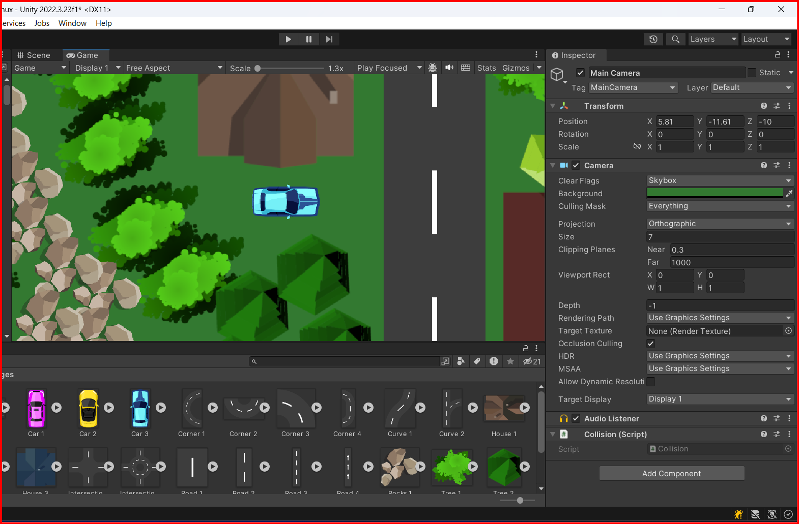

# Camera

In Unity, the camera is a component that captures the scene from a specific point of view and displays it on the screen. The camera is used to render the scene from the perspective of the player or other objects in the game. The camera can be positioned, rotated, and scaled to achieve different visual effects in the game.

## Changing background color

You can change the background color of the camera by selecting the camera in the Hierarchy window and changing the `Background` property in the Camera component in the Inspector window. You can choose a color by clicking on the color picker next to the Background property. You can see the selected color in the `Game` view.



## Following a target

You can make the camera follow a target object by creating a script that moves the camera to the position of the target object. Here is an example of how to make the camera follow a target object:

```csharp
using System.Collections;
using System.Collections.Generic;
using UnityEngine;

public class FollowCamera : MonoBehaviour
{
    [SerializeField] GameObject thingToFollow; // car object
    // camera position will be the same as car's position

    void LateUpdate() // LateUpdate is called after Update each frame and it is used to adjust the camera's position after the target Object position has been updated
    {
        transform.position = thingToFollow.transform.position + new Vector3(0, 0, -10);
    }
}
```

&larr; [Back to Begin](./readme.md)