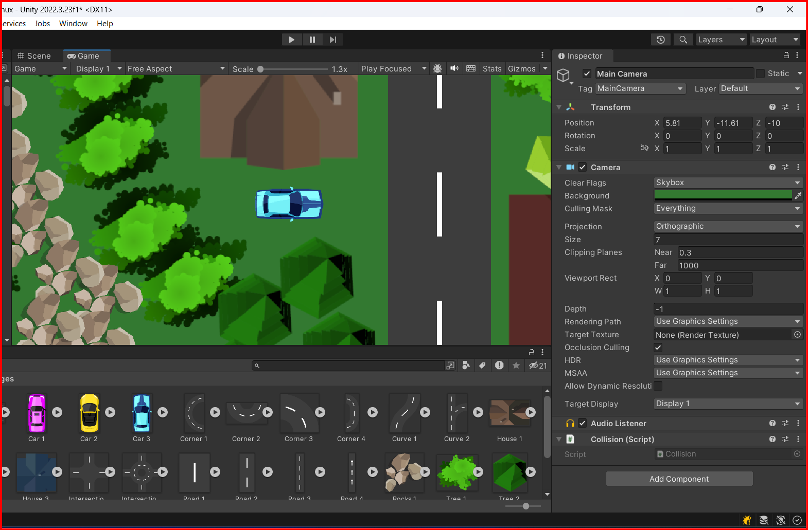
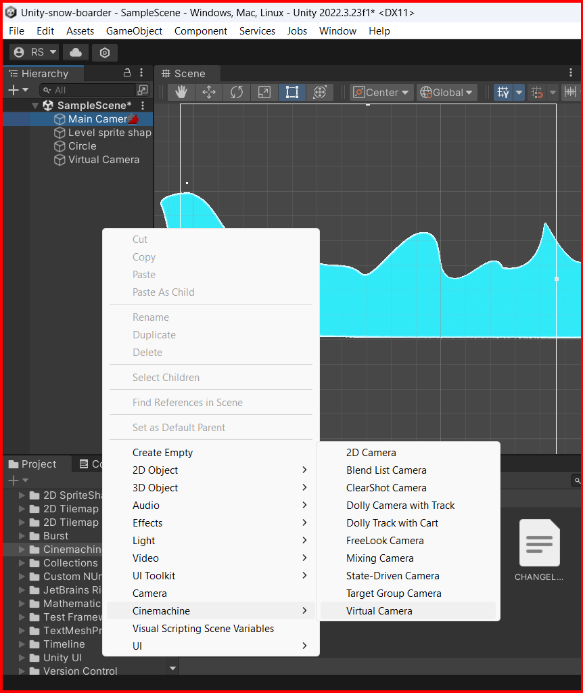
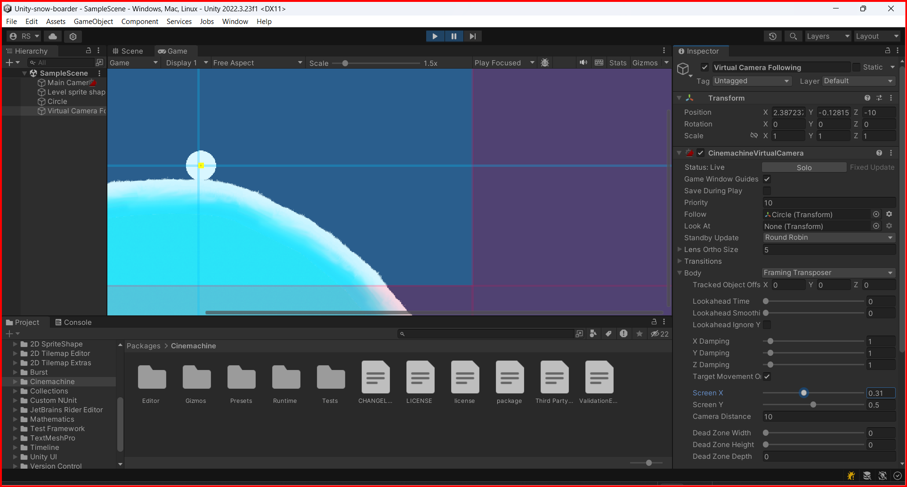

# Camera

In Unity, the camera is a component that captures the scene from a specific point of view and displays it on the screen. The camera is used to render the scene from the perspective of the player or other objects in the game. The camera can be positioned, rotated, and scaled to achieve different visual effects in the game.

## Changing background color

You can change the background color of the camera by selecting the camera in the Hierarchy window and changing the `Background` property in the Camera component in the Inspector window. You can choose a color by clicking on the color picker next to the Background property. You can see the selected color in the `Game` view.



## Following a target

You can make the camera follow a target object by creating a script that moves the camera to the position of the target object. Here is an example of how to make the camera follow a target object:

```csharp
using System.Collections;
using System.Collections.Generic;
using UnityEngine;

public class FollowCamera : MonoBehaviour
{
    [SerializeField] GameObject thingToFollow; // car object
    // camera position will be the same as car's position

    void LateUpdate() // LateUpdate is called after Update each frame and it is used to adjust the camera's position after the target Object position has been updated
    {
        transform.position = thingToFollow.transform.position + new Vector3(0, 0, -10);
    }
}
```

## Cinemachine (package)

Cinemachine is a powerful and flexible camera system for Unity that allows you to create cinematic camera movements and effects in your game. Cinemachine provides a set of tools and components that allow you to create complex camera behaviors without writing code. You can use Cinemachine to create camera movements, follow targets, and create cinematic effects in your game.

To use Cinemachine in your project, you need to install the Cinemachine package from the Unity Package Manager. To install the Cinemachine package./
Open the Unity Package Manager by going to `Window` -> `Package Manager`.

### Adding a Cinemachine to scene

To add a Virtual camera to the scene, right-click in the Hierarchy window and select `Cinemachine` -> `Virtual Camera`. You can adjust the properties of the Virtual Camera in the Inspector window.



### Following a target with Cinemachine

You can make the Virtual Camera follow a target object at the `body` property in the Virtual Camera component in the Inspector window.  set the combo box to `Framing Transposer` and set the `Follow` property to the target object.

you can adjust the properties of the Framing Transposer in the Inspector window to control how the camera follows the target object, like showing some more space ahead of the target object.

to change the position of the camera, you can adjust the `Screen X` and `Screen Y` properties in the `body` property.



&larr; [Back to Begin](./readme.md)