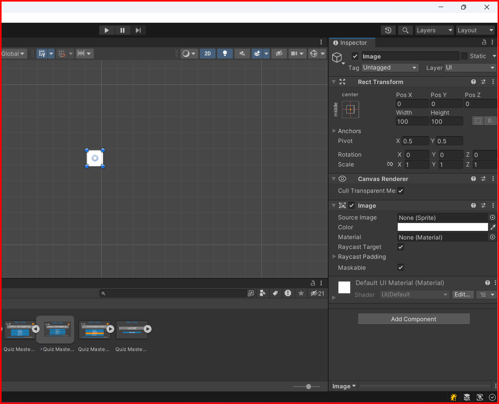
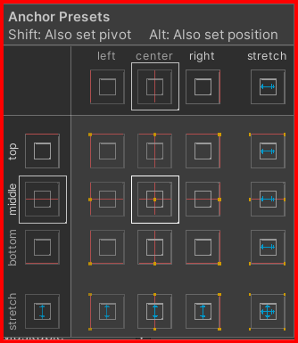
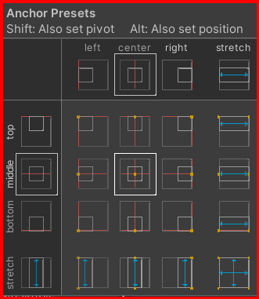
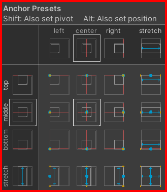
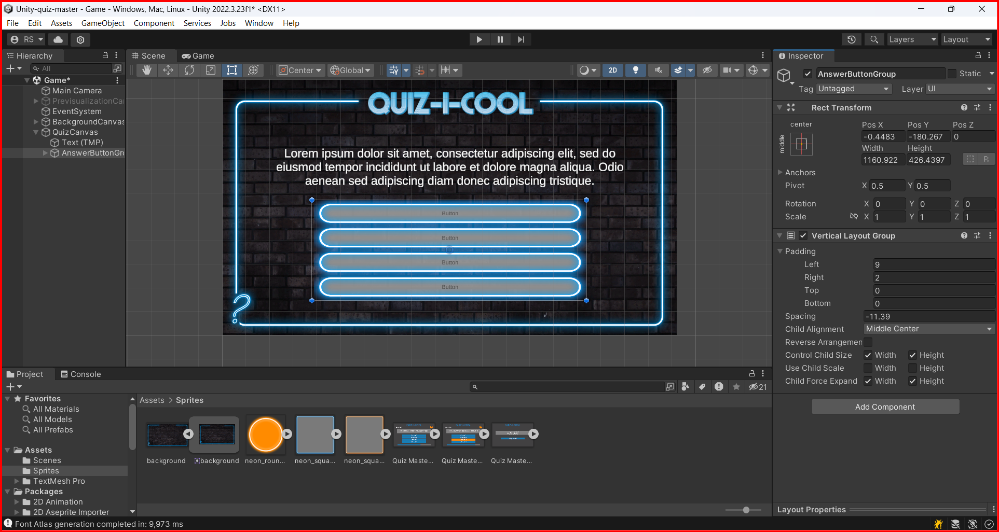

# Canvas

What is a canvas? A canvas is a component that is used to render graphics in unity.
The Canvas is the area that all UI elements should be inside. The Canvas is a Game Object with a Canvas component on it, and all UI elements must be children of such a Canvas.

## Adding a canvas

To add a canvas, right-click in the hierarchy window and select `UI -> Canvas`.

## Render Modes

There are three render modes in the canvas component:

* **Screen Space - Overlay**: The canvas is rendered on top of everything else in the scene. This render mode places UI elements on the screen rendered on top of the scene. If the screen is resized or changes resolution, the Canvas will automatically change size to match this.
  
* **Screen Space - Camera**: The canvas is rendered in front of the camera. This is similar to Screen Space - Overlay, but in this render mode the Canvas is placed a given distance in front of a specified Camera. The UI elements are rendered by this camera, which means that the Camera settings affect the appearance of the UI. If the Camera is set to Perspective, the UI elements will be rendered with perspective, and the amount of perspective distortion can be controlled by the Camera Field of View. If the screen is resized, changes resolution, or the camera frustum changes, the Canvas will automatically change size to match as well.
  
* **World Space**: The canvas is rendered in the scene. This render mode places UI elements in the scene rendered by a camera. This allows the UI to be positioned in the scene as if it were a 3D object. In this render mode, the Canvas will behave as any other object in the scene. The size of the Canvas can be set manually using its Rect Transform, and UI elements will render in front of or behind other objects in the scene based on 3D placement. This is useful for UIs that are meant to be a part of the world. This is also known as a "diegetic interface".

## Adding UI elements

To add UI elements, right-click on the canvas and select the UI element you want to add. You can add text, image, button, etc. You also can still add GameObjects to the canvas.

[Canvas Image](./canvas_image.md)\
[Canvas Text TextMeshPro](./canvas_text_textmeshpro.md)\
[Canvas Button TextMeshPro](./canvas_button.md)
[Canvas Slider](./canvas_slider.md)

### Positioning UI elements

To position UI elements, you can use the Rect Transform component. The Rect Transform component is the 2D layout system that controls the position, size, and anchoring of the UI elements in a canvas.

### Anchoring UI elements

Anchoring is a way to position UI elements relative to the edges of the canvas. You can anchor UI elements to the top, bottom, left, right, or center of the canvas.

    
Anchoring elements in canvas without positioning the pivot.

    
     
Anchoring elements in canvas with stretching. holding <code>Shift</code> Key

    

    
Anchoring elements in canvas with positioning the pivot. holding <code>Ctrl</code> Key

    
    
Anchoring elements in canvas with stretching and positioning the pivot. holding <code>Ctrl + Shift</code> Keys

    

## Displaying Ordened UI elements with Empty GameObjects

You can use empty GameObjects to organize your UI elements. This is useful when you have a lot of UI elements and you want to group them together, also you can add a component to the empty GameObject to control the group of UI elements, like vertical layout group, horizontal layout group, grid layout group, etc.

Here is a example of how to use a vertical layout group to organize UI elements:

In this example, the vertical layout group is used to organize 4 buttons (children of the GameObject named `AnswerButtonGroup`) in a vertical layout. Stretching the buttons to fill the bounds of the `AnswerButtonGroup` and adding spacing between the buttons.

&larr; [Back to Begin](./readme.md)
