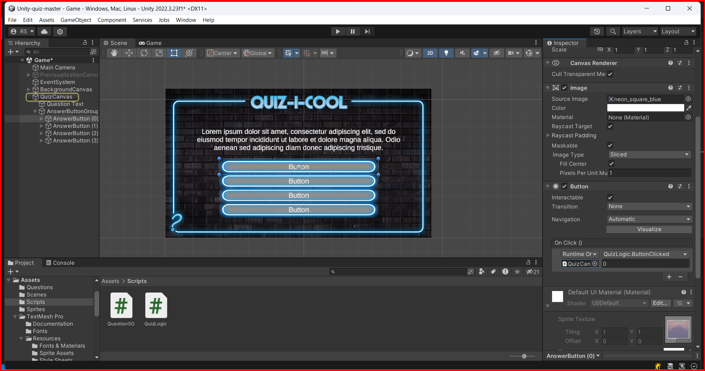

# Canvas Button TextMeshPro

A button is a UI element that is used to trigger an event when clicked. In Unity, you can add a button to a canvas by right-clicking on the canvas and selecting `UI -> Button TextMeshPro`.

## OnClick Event

To add an event to the button, you can use the `OnClick` event in the button component. You can add a new event by clicking the `+` button in the `On Click` event list. You can then select the `object` that contains the method you want to call and the method itself.

Just for don't let margin for doubts, in the case of the Image the object that contains the method is `QuizCanvas`, so at the button `OnClick` event, we select the `QuizCanvas` object and the method `ButtonClicked`, passing the index that you want.

&larr; [Back to Canvas](./canvas.md)\
&larr; [Back to Begin](./readme.md)