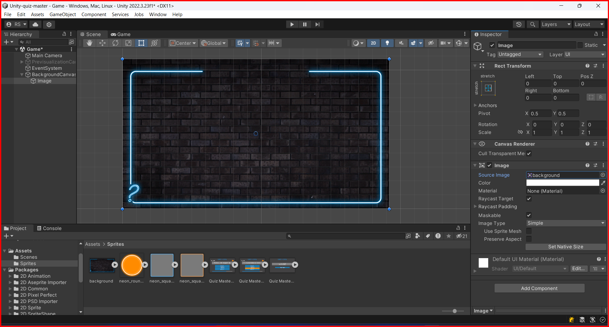

# Canvas Image Element

To add an image to a UI element, you can use the Image component. The Image component is used to display images in the UI. You can use the Image component to display sprites, textures, or colors.

