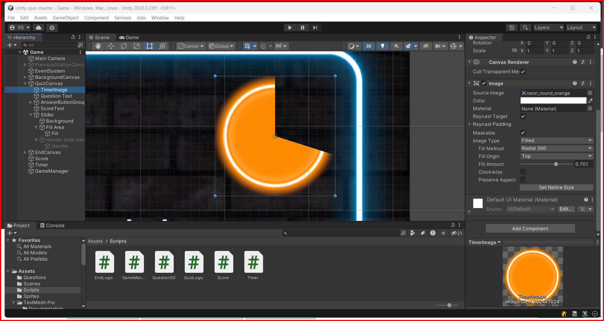

# Canvas Image Element

To add an image to a UI element, you can use the Image component. The Image component is used to display images in the UI. You can use the Image component to display sprites, textures, or colors.

## Image Component

The Image component has the following properties:

* **Sprite**: The sprite that the image will display.
* **Color**: The color of the image.
* **Material**: The material that the image will use.
* **Raycast Target**: If enabled, the image will receive raycasts.
* **Maskable**: If enabled, the image will be masked by a mask component.
* **Type**: The type of image. It can be simple, sliced, tiled, or filled.
* **Fill Method**: The method used to fill the image. It can be horizontal, vertical, radial90, radial180, radial360, or radial.
* **Fill Origin**: The origin of the fill method. It can be bottom, top, left, right, bottom-left, top-left, bottom-right, or top-right.
* **Fill Amount**: The amount of the image that is filled.
* **Preserve Aspect**: If enabled, the aspect ratio of the image will be preserved.
* **Clockwise**: If enabled, the fill method will be clockwise.

