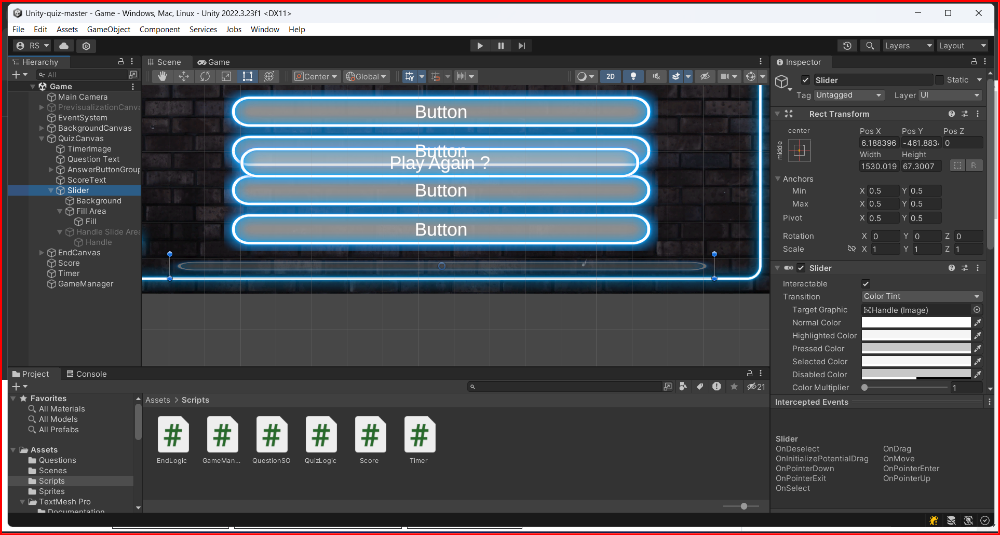

# Canvas Slider

A slider is a UI element that allows the user to select a value from a range of values. In Unity, you can add a slider to a canvas by right-clicking on the canvas and selecting `UI -> Slider`.

## Slider Component

The slider component has the following properties:

* **Min Value**: The minimum value of the slider.
* **Max Value**: The maximum value of the slider.
* **Value**: The current value of the slider.
* **Whole Numbers**: If enabled, the slider will only allow integer numbers instead of floats.
* **On Value Changed**: A UnityEvent that is triggered when the value of the slider changes.
* **Fill Rect**: The RectTransform of the fill area of the slider.
* **Handle Rect**: The RectTransform of the handle of the slider.
* **Direction**: The direction in which the slider moves. It can be left to right, right to left, bottom to top, or top to bottom.
* **Slider Graphic**: The graphic that represents the slider.
* **Min Handle Size**: The minimum size of the handle.
* **Max Handle Size**: The maximum size of the handle.
* **Interactable**: If enabled, the slider can be interacted with.

### Slider components

1. Background: The background of the slider.
2. Fill Area: The fill area of the slider.
   1. Fill: The fill of the slider. 
3. Handle Slide Area: The area where the handle can slide.
   1. Handle: The handle of the slider. 

