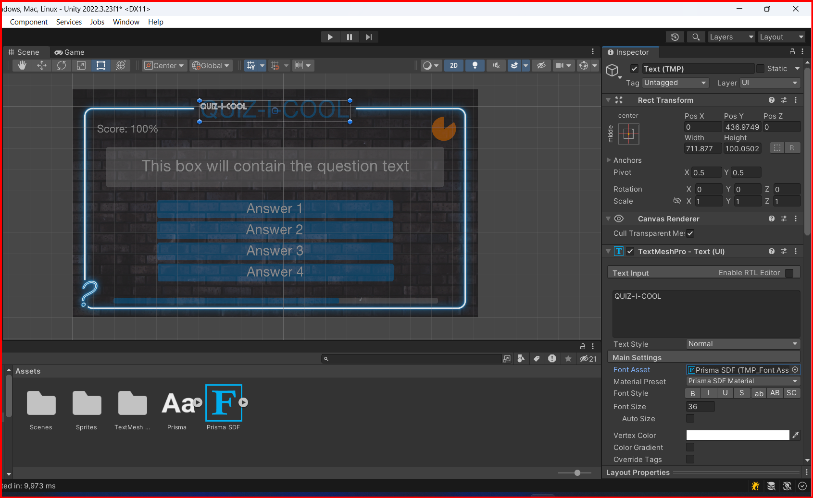

# Text - TextMeshPro

TextMeshPro is a powerful text rendering solution that allows you to have full control over your text. It is a replacement for Unity's built-in text components and provides enhanced features and flexibility. TextMeshPro is a free asset available in the Unity Asset Store.

## If you don't have TextMeshPro installed

If you don't have TextMeshPro installed in your project, you can install it from the Unity Package Manager. Here is how you can install TextMeshPro:

1. Open the Unity Package Manager window by selecting `Window -> Package Manager`.
2. Then find TextMeshPro in the list of packages and click on the `Install` button.

## Setup TextMeshPro

To use TextMeshPro in your project, you need to import the TextMeshPro package. Here is how you can set up TextMeshPro in your project:

1. Import the TextMeshPro package into your project. You can do this by selecting `Window -> TextMeshPro -> Import TMP Essential Resources`.

2. Then click on the `Import TMP Essential Resources` button to import the TextMeshPro package into your project.

## Adding fonts to TextMeshPro

TextMeshPro uses fonts to render text. You can add fonts to TextMeshPro by importing them into your project. Here is how you can add fonts to TextMeshPro:

1. Import the font into your project. You can do this by selecting `Window -> TextMeshPro -> Font Asset Creator`.

2. Then click on the `Generate Font Atlas` button.
3. When the font atlas is generated, click on the `Save` or `Save as` button to save the font asset.
4. With the font asset saved, you can now use it in your TextMeshPro components.

&larr; [Back to Canvas](./canvas.md)\
&larr; [Back to Begin](./readme.md)
