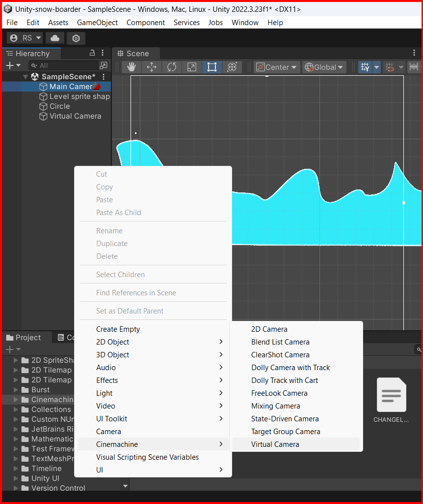
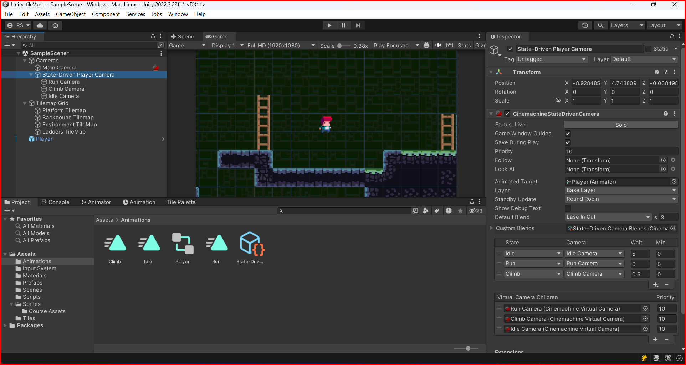

# Cinemachine (package)

Cinemachine is a powerful and flexible camera system for Unity that allows you to create cinematic camera movements and effects in your game. Cinemachine provides a set of tools and components that allow you to create complex camera behaviors without writing code. You can use Cinemachine to create camera movements, follow targets, and create cinematic effects in your game.

To use Cinemachine in your project, you need to install the Cinemachine package from the Unity Package Manager. To install the Cinemachine package./
Open the Unity Package Manager by going to `Window` -> `Package Manager`.

## Adding a Cinemachine to scene

To add a Virtual camera to the scene, right-click in the Hierarchy window and select `Cinemachine` -> `Virtual Camera`. You can adjust the properties of the Virtual Camera in the Inspector window.

## Following a target with Cinemachine

You can make the Virtual Camera follow a target object at the `body` property in the Virtual Camera component in the Inspector window.  set the combo box to `Framing Transposer` and set the `Follow` property to the target object.

you can adjust the properties of the Framing Transposer in the Inspector window to control how the camera follows the target object, like showing some more space ahead of the target object.

to change the position of the camera, you can adjust the `Screen X` and `Screen Y` properties in the `body` property.

## Bounding camera to a specific area

You can make the Virtual Camera follow a target object within a specific area by adding a Collider component to the target object. Then you show add the `confiner` extension to the Virtual Camera component in the Inspector window and set the `Bounding Shape 2D` property to the Collider component.

Lets take a example, we will use the `Background Tilemap` to add a collider to the camera.

here we will use a `Polygon Collider 2D` to the `Background Tilemap` object.
**NOTE: in Unity version 2022+ is inprecindible to to check `Is Trigger` in the `Polygon Collider 2D`.**

Now, make sure the `Main Camera` has the `Projection` as `Orthographic`.

Next, we will create a virtual camera and add the `Confiner` extension to the virtual camera and set the `Bounding Shape 2D` property to the `Polygon Collider 2D` component and check `Confine Screen Edges`.

### Extra steps(v2021 aparently)
For Unity version 2021, we will need to add a two layers(not sorting layers), one for the `Background` and another for the `Player`. and set the `Background` layer to the `Background Tilemap` object and the `Player` layer to the `Player` object. 

Then we will also need to change the `Physics 2D` settings in the `Project Settings` -> `Physics 2D` matrix. and remove the `Background` from the `Default` layer.

## State-driven camera

You can create different camera behaviors using Cinemachine by adding different states to the Virtual Camera. You can add different states to the Virtual Camera by adding a Cinemachine State Driven Camera component to the Virtual Camera and adding different Cinemachine State Driven Camera State components to the State Driven Camera component.

### creating a state-driven camera

To create a state-driven camera, select the hierarchy window and right-click on a empty space and select `Cinemachine` -> `State Driven Camera`. 
Then this will create a new virtual camera. You can add a previosly created virtual camera to the `State Driven Camera` component, by dragging the virtual camera to it.

Add or drop some virtual cameras to the `State Driven Camera` component.

When you add a camera to the `State Driven Camera` component, you will see then até the property `Virtual Camera Children`.

#### Creating a states
First you need to add the The `Animator Controller` that you previously created to the `State Driven Camera` component, at the property `Animated Target`.

Then you can add a new state to the `State Driven Camera` component by clicking on the plus button below the State table.
To create a state, select the `State Driven Camera` component and click on the plus button below the State table. This will create a line in the State table. You can then select the states from the Animator Controller that you want to add to the State table and link them to the Virtual Camera you want to use for that state.

States can have a wait time, that is a time in seconds that the camera will wait before transitioning to the next state. You can set the wait time for a state by selecting the state in the State table and setting the Wait property in the Inspector window.

##### Custom blends

You can create custom blends between states by adding a Cinemachine Blend List Camera component to the Virtual Camera and adding different Cinemachine Blend List Camera Blend components to the Blend List Camera component. You can then adjust the properties of the Blend components to control how the camera blends between different states.

When you add a blend you need to save an asset for the blend in a folder, and then you can select the blend in the `Blend` property.

blends can have a `Style` property that can be `Cut` or `Ease In Out`. The `Cut` style will make the camera transition instantly between states, while the `Ease In Out` style will make the camera transition smoothly between states.

bleds have `Time` property that is the time in seconds that the camera will take to transition between states.

&larr; [Back to Camera](./camera.md)\
&larr; [Back to Begin](./readme.md)