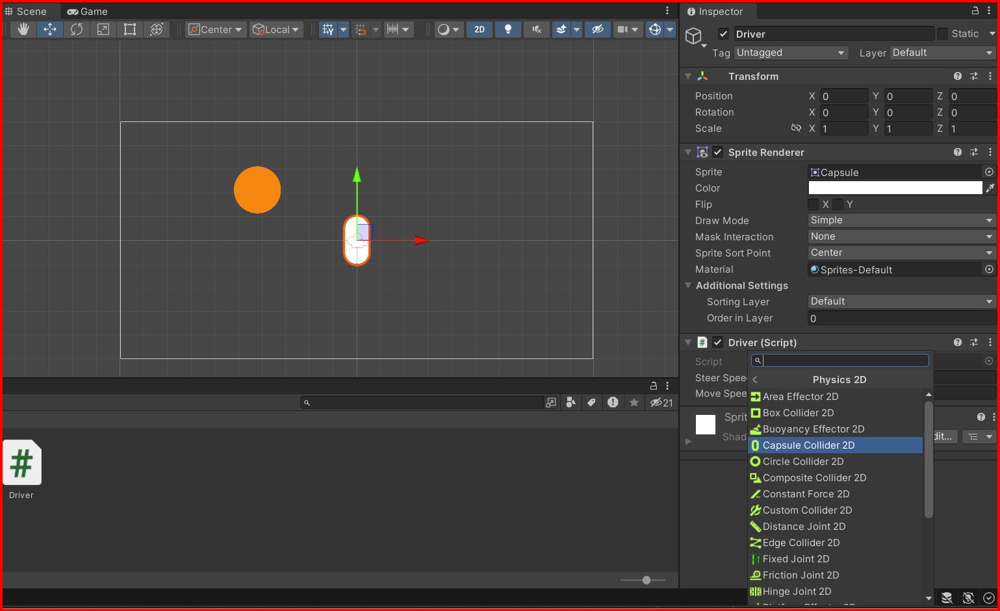

# Colliders and Ridig bodies

## Colliders

Colliders are the components that define the shape of a GameObject. They are used to detect collisions and trigger events. Colliders can be attached to any GameObject, but are most often used with GameObjects that are intended to interact with the physical world. For example, a GameObject that represents a car might have a collider that defines the shape of the car's body, wheels, and other parts.

Unity provides several types of colliders, each of which is suited to different types of objects and interactions. Some of the most common colliders include:

- BoxCollider: A simple box-shaped collider that can be used for objects with simple shapes.
- SphereCollider: A collider that defines a sphere-shaped volume.
- CapsuleCollider: A collider that defines a capsule-shaped volume.
- MeshCollider: A collider that uses a mesh to define the shape of an object.
- TerrainCollider: A collider that is used with terrain objects.
- WheelCollider: A collider that is used with wheel objects.
- CharacterController: A collider that is used with characters.
- CompositeCollider2D: A collider that is used with 2D objects.
- EdgeCollider2D: A collider that is used with 2D objects.
- BoxCollider2D: A collider that is used with 2D objects.
- CircleCollider2D: A collider that is used with 2D objects.
- PolygonCollider2D: A collider that is used with 2D objects.
- CapsuleCollider2D: A collider that is used with 2D objects.
- TilemapCollider2D: A collider that is used with 2D objects.
- TerrainCollider2D: A collider that is used with 2D objects.
- CompositeCollider2D: A collider that is used with 2D objects.
- EdgeCollider2D: A collider that is used with 2D objects.

### Adding a Collider to a GameObject

To add a collider to a GameObject, select the GameObject in the Hierarchy window, then click the `Add Component` button in the Inspector window. In the search bar, type the name of the collider you want to add (e.g., `BoxCollider 2D`), then click on the collider in the search results. The collider will be added to the GameObject, and you can adjust its properties in the Inspector window.



## Rigidbody

Rigidbodies are components that are used to simulate physical interactions between GameObjects. They are used to apply forces, torques, and collisions to GameObjects, allowing them to move and interact with the physical world. Rigidbodies are often used in conjunction with colliders to create realistic physical interactions.

Rigidbodies can be attached to any GameObject, but are most often used with GameObjects that are intended to interact with the physical world. For example, a GameObject that represents a car might have a Rigidbody component that allows it to move and collide with other objects.

### Adding a Rigidbody to a GameObject

To add a Rigidbody to a GameObject, select the GameObject in the Hierarchy window, then click the `Add Component` button in the Inspector window. In the search bar, type `Rigidbody 2D`, then click on the Rigidbody in the search results. The Rigidbody component will be added to the GameObject, and you can adjust its properties in the Inspector window. The same process as adding a collider.


## Passing through objects

If you want to pass through objects, you can set the collider to `isTrigger` in the inspector window. This will allow the GameObject to pass through other GameObjects without colliding with them. When a GameObject with a trigger collider enters the trigger volume of another GameObject, the `OnTriggerEnter` method is called on the other GameObject.

## Create a script to detect collisions

To detect collisions between GameObjects, you can create a script that uses the `OnCollisionEnter` or `OnTriggerEnter` methods. These methods are called when a GameObject collides with another GameObject or enters a trigger volume, respectively.

Here is an example of a script that uses the `OnCollisionEnter` method to detect collisions between two GameObjects:

```csharp
using System.Collections;
using System.Collections.Generic;
using UnityEngine;

public class Collision : MonoBehaviour
{
    void OnCollisionEnter2D(Collision2D other) {
        Debug.Log("Collision with " + other.gameObject.name);
   }
}

```

In this script, the `OnCollisionEnter2D` method is called when the GameObject collides with another GameObject. The `other` parameter is a reference to the other GameObject involved in the collision. You can use this reference to access information about the other GameObject, such as its name or tag.

The same proccess can be done with `OnTriggerEnter2D` method.


 Attach this script to the GameObject that you want to detect collisions with, and it will log a message to the console whenever a collision occurs.