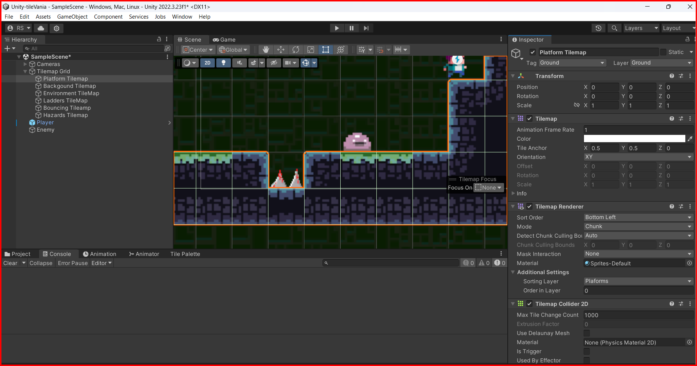
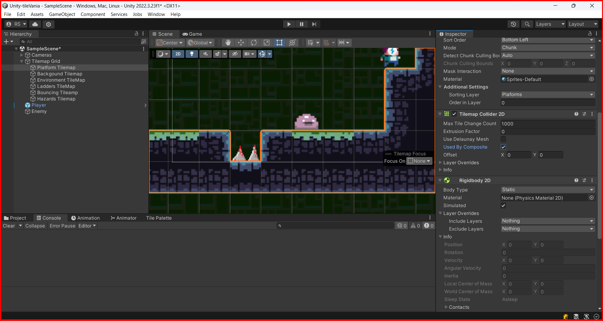

# Composite colliders  

Composite colliders are a way to combine multiple colliders into a single collider. This is useful for creating complex shapes that would be difficult to create with a single collider.

 why would you want to use a composite collider instead of a single collider? The main reason is performance. When you have a complex shape made up of multiple colliders, Unity has to check for collisions with each individual collider. This can be slow, especially if you have a lot of colliders in your scene. By combining the colliders into a single composite collider, Unity only has to check for collisions with a single collider, which can be much faster.

Another reason to use composite colliders is that they can be more accurate than using a single collider. When you have a complex shape made up of multiple colliders, you can get more accurate collision detection by using a composite collider. This is because the composite collider can be made up of multiple colliders that are each individually more accurate than a single collider.

Let't take a example in a platform game 

As you can see every little tile is a collider, so if you have a lot of tiles in your scene, Unity has to check for collisions with each individual tile. This can be slow, especially if you have a lot of tiles in your scene. By combining the colliders into a single composite collider, Unity only has to check for collisions with a single collider, which can be much faster.

To create a composite collider, you need to add a Composite Collider 2D component to the GameObject that you want to create the composite collider for. You can then add child colliders to the GameObject, and then at the Tilemap Collider 2D component, check the `Used by Composite` checkbox.

