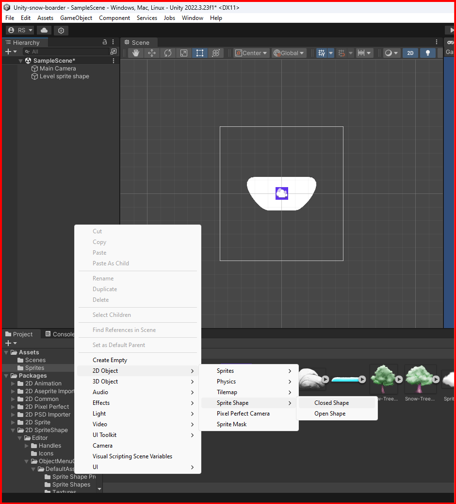
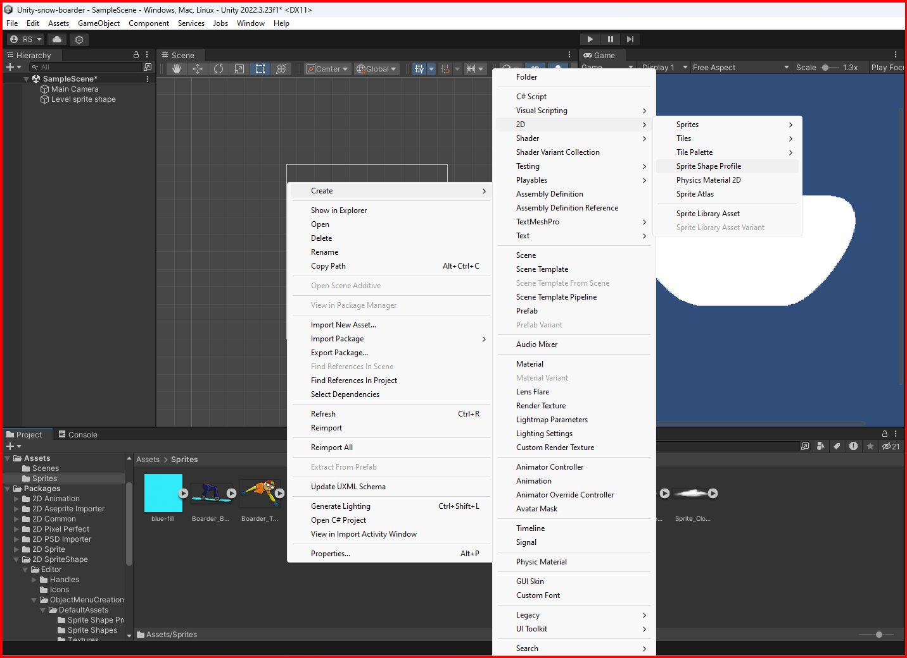
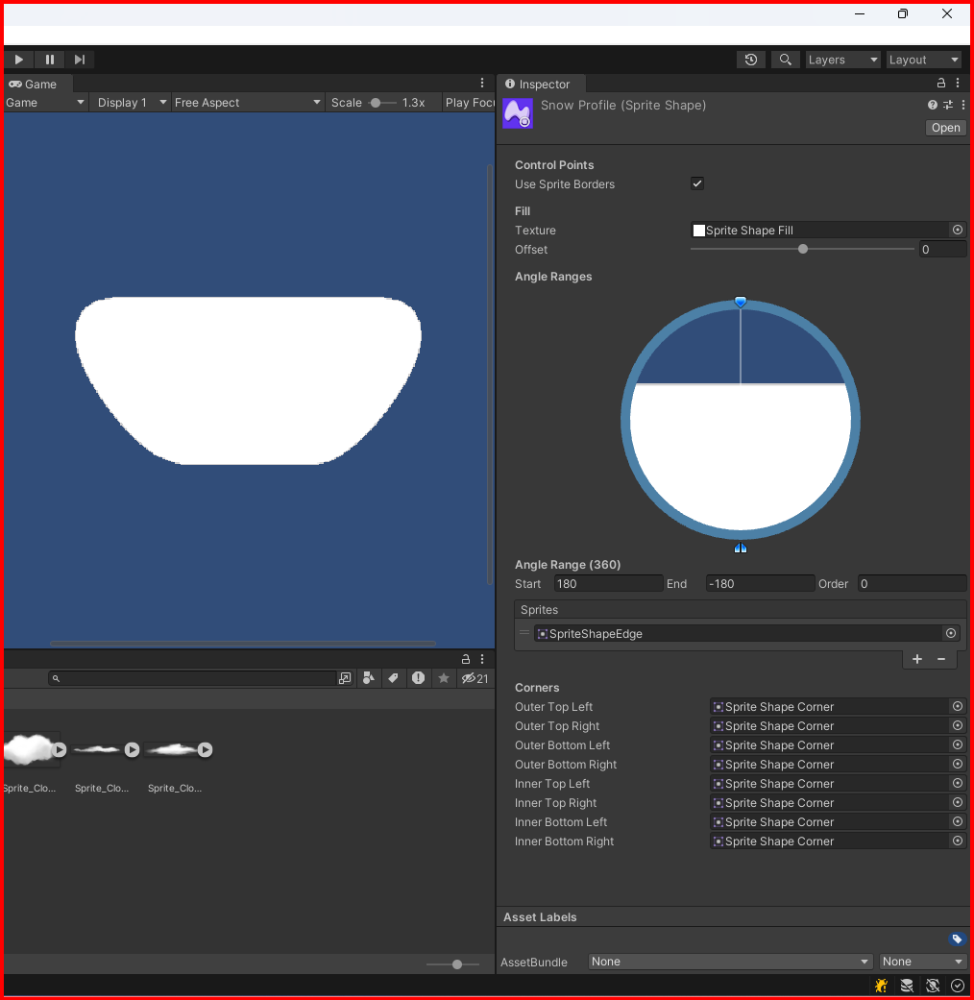
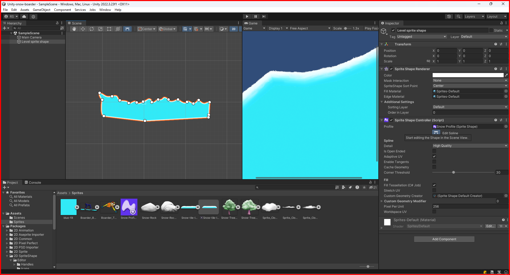

# Custom shapes

In unity you can create custom shapes in many ways. 

## 2D Shapes

### Close sprite shape

You can create a custom shape by creating a closed sprite shape. This will allow you to create a shape with **multiple sprites**. Right click in the hierarchy window and select `2d object -> sprite shape -> closed sprite shape`.

#### Adding sprites to the shape
Right click in the assets window and select `create -> 2d -> sprite shape profile`.

Select the sprite shape profile and in the inspector window, you can add the sprites that you want to use in the shape.\
The closed sprite shape have some maps that you can use to create the shape, this maps are:
- **Fill texture** - This map will fill the shape with the texture that you select.
- **Edge texture** - This map will fill the edge of the shape with the texture that you select.
- **Out Top Left** - This map will fill the top left corner of the shape with the texture that you select.
- **Out Top Right** - This map will fill the top right corner of the shape with the texture that you select.
- **Out Bottom Left** - This map will fill the bottom left corner of the shape with the texture that you select.
- **Out Bottom Right** - This map will fill the bottom right corner of the shape with the texture that you select.
- **Inner Top Left** - This map will fill the top left corner of the shape with the texture that you select.
- **Inner Top Right** - This map will fill the top right corner of the shape with the texture that you select.
- **Inner Bottom Left** - This map will fill the bottom left corner of the shape with the texture that you select.
- **Inner Bottom Right** - This map will fill the bottom right corner of the shape with the texture that you select.

#### Editing the shape

Select the closed sprite shape in the hierarchy window and in the inspector window you can edit the shape by clicking in the `Edit spline` button.\

&larr; [Back to Begin](./readme.md)