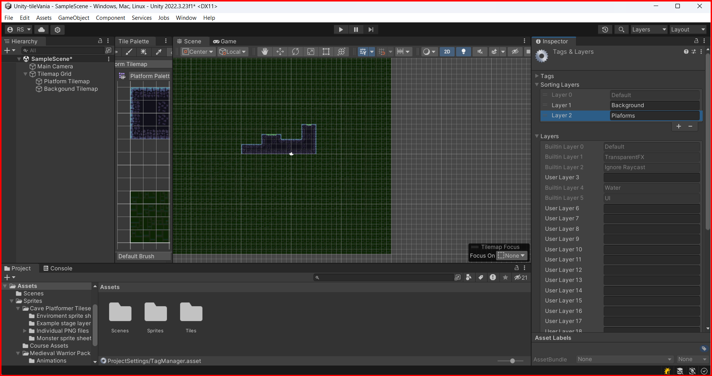
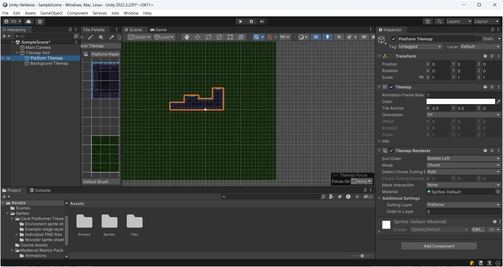

# Layers

In unity, layers are used to categorize objects. This is useful when you want to apply a certain effect to a group of objects. For example, you can create a layer called "Player" and apply a certain effect to all objects in that layer.

## Adding a Layer

### Working if layers in tilemaps

Let's supose that we have 2 tilemaps, one for the platform and another for the background. We want that the platform tilemap is in front of the background tilemap. To do this, we need to create 2 `Sorting layers`, one for the platform and another for the background. Then put the platform layer in front of the background layer.

Firts, we need to create the layers. Just select any object in the hierarchy window. Then at the inspector window, click in the Layer dropdown and select `Add Layer`.

Then, you will see a new window caller `Tags & Layers`. In `Sorting Layers`, you can add a new layer. Click in the `+` button and add a new layer. add a new layer called `Background` and another called `Platform`.

Then, just drag the `Platform` layer to the bottom of the `Background` layer.

Back to the Hierachy window, select the tilemap that you want to change the layer. Then, at the inspector window at the Tilemap Renderer component, go to `Aditional Settins` change the `Sorting Layer` to the layer that you want.

