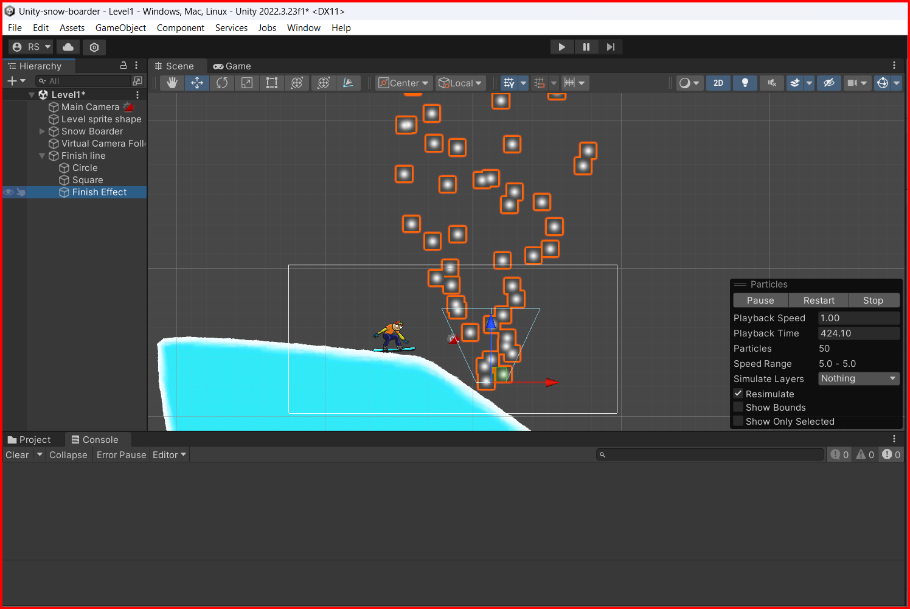
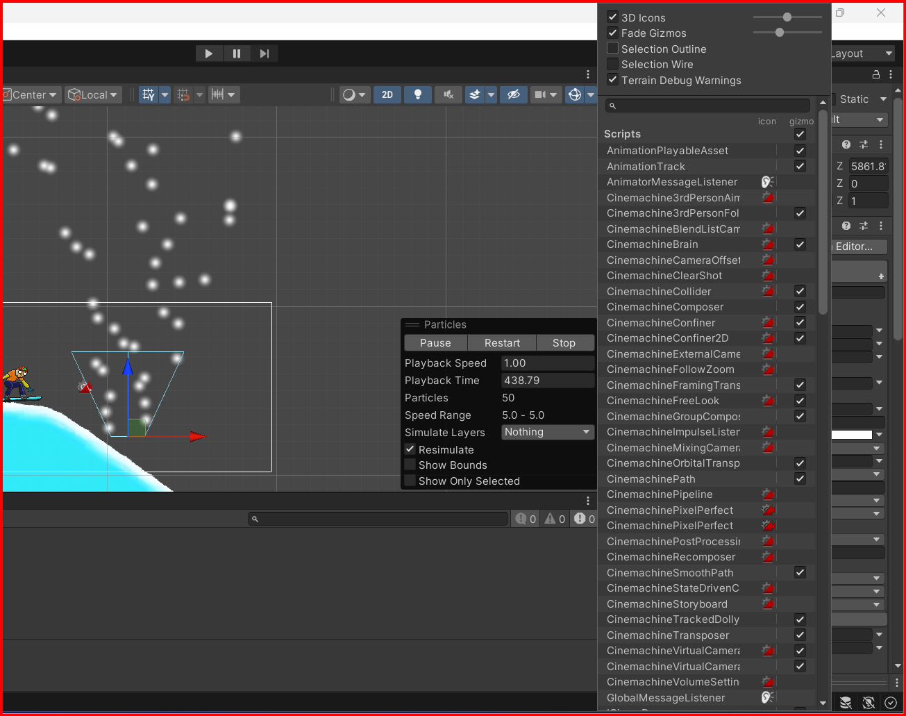
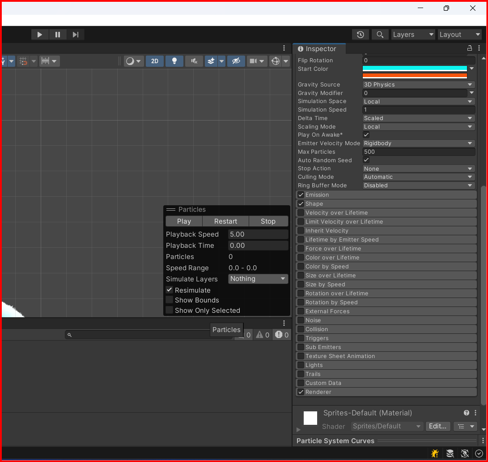
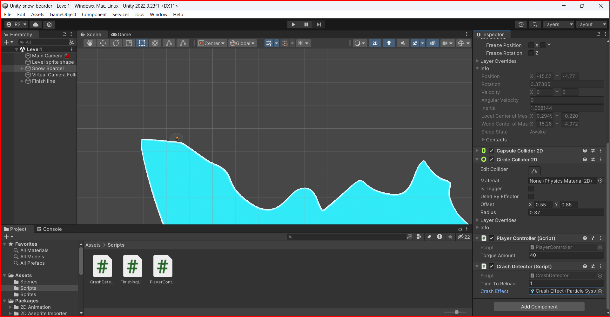
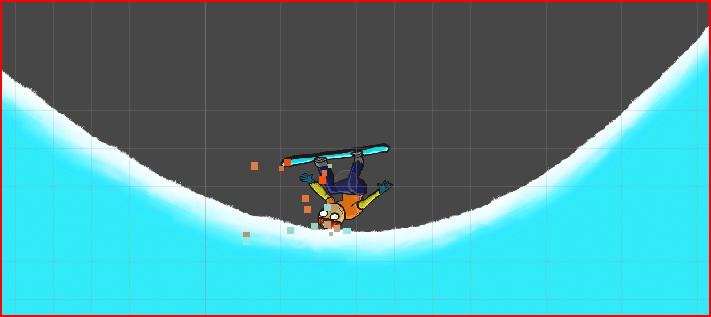

# Particles

Particles are used to create effects like fire, smoke, rain, etc. In Unity, you can create particles by going to the hierarchy window and right-clicking on the hierarchy window, then select `Effects -> Particle System`.



You can change the properties of the particle system in the inspector window. You can change the duration, start lifetime, start speed, start size, start rotation, etc.
You also, can remove the outline of the particle system by unchecking the `Selection outline` checkbox.



## Particle properties

Particles have an almost infinite number of properties that you can change to create the effect you want. Here are some of the most common properties that you can change:


- **Duration**: The duration of the particle system in seconds.
- **Start Lifetime**: The lifetime of the particles in seconds.
- **Start Speed**: The initial speed of the particles.
- **Start Size**: The initial size of the particles.
- **Start Rotation**: The initial rotation of the particles.
- **Start Color**: The initial color of the particles.
- **Gravity Modifier**: The strength of the gravity applied to the particles.
- **Simulation Space**: The space in which the particles are simulated (local or world space).
- **Max Particles**: The maximum number of particles that can be emitted.
- etc...


Then you also have the `Emission`, `Shape`, `Renderer` and many other properties that have their own sub-properties that you can change to create the effect you want.




## Adding particles to a GameObject

You can add particles to a GameObject by dragging and dropping the particle system from the hierarchy window to the GameObject in the scene view.
to use in a script you must serialize the particle system and then you can call in the script.

```csharp

using System.Collections;
using System.Collections.Generic;
using UnityEngine;
using UnityEngine.SceneManagement;

public class CrashDetector : MonoBehaviour
{   
    Collider2D playerHead;
    [SerializeField] float timeToReload = 0.5f; // 1
    [SerializeField] ParticleSystem crashEffect;
    void Start() {
        playerHead = GetComponent<CircleCollider2D>();
    }

    void OnCollisionEnter2D(UnityEngine.Collision2D other)
    {
        EdgeCollider2D ground = other.gameObject.GetComponent<EdgeCollider2D>();
        bool isColidding = playerHead.IsTouching(ground); 
        bool isTheGround = other.gameObject.CompareTag("Ground");

        if(isTheGround && isColidding){
            crashEffect.Play();
            Invoke("ReloadScene", timeToReload);
        }
    }

    void ReloadScene(){
        SceneManager.LoadScene(0);
    }
}
```

In this example, the `crashEffect` particle system is played when the player collides with the ground. The `ReloadScene` method is called after `timeToReload` seconds have passed.



This is a simple example of how to use particles in Unity. You can create more complex effects by changing the properties of the particle system and adding more particles to the scene.

