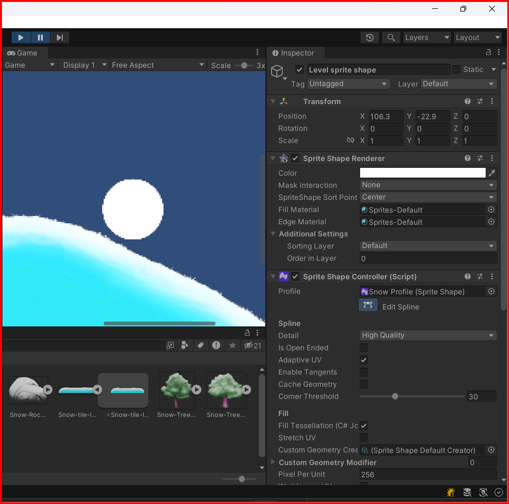

# Physics in Unity

## Colliders and Dynamic sprite

Colliders are the components that define the shape of a GameObject. They are used to detect collisions and trigger events. Colliders can be attached to any GameObject, but are most often used with GameObjects that are intended to interact with the physical world. For example, a GameObject that represents a car might have a collider that defines the shape of the car's body, wheels, and other parts.

Unity provides several types of colliders, each of which is suited to different types of objects and interactions. Some of the most common colliders include:

- BoxCollider: A simple box-shaped collider that can be used for objects with simple shapes.
- SphereCollider: A collider that defines a sphere-shaped volume.
- CapsuleCollider: A collider that defines a capsule-shaped volume.
- MeshCollider: A collider that uses a mesh to define the shape of an object.
- TerrainCollider: A collider that is used with terrain objects.
- WheelCollider: A collider that is used with wheel objects.
- CharacterController: A collider that is used with characters.
- CompositeCollider2D: A collider that is used with 2D objects.
- EdgeCollider2D: A collider that is used with 2D objects.
- BoxCollider2D: A collider that is used with 2D objects.
- CircleCollider2D: A collider that is used with 2D objects.
- PolygonCollider2D: A collider that is used with 2D objects.
- CapsuleCollider2D: A collider that is used with 2D objects.
- TilemapCollider2D: A collider that is used with 2D objects.
- TerrainCollider2D: A collider that is used with 2D objects.
- CompositeCollider2D: A collider that is used with 2D objects.
- EdgeCollider2D: A collider that is used with 2D objects.

### Adding a Collider to a GameObject

To add a collider to a GameObject, select the GameObject in the Hierarchy window, then click the `Add Component` button in the Inspector window. In the search bar, type the name of the collider you want to add (e.g., `BoxCollider 2D`), then click on the collider in the search results. The collider will be added to the GameObject, and you can adjust its properties in the Inspector window.


### Create a script to detect collisions

To detect collisions between GameObjects, you can create a script that uses the [`OnCollisionEnter`](./OnCollisionEnter.md) or [`OnTriggerEnter`](./OnTriggerEnter.md) methods. These methods are called when a GameObject collides with another GameObject or enters a trigger volume, respectively.

Here is an example of a script that uses the [`OnCollisionEnter`](./OnCollisionEnter.md) method to detect collisions between two GameObjects:

```csharp
using System.Collections;
using System.Collections.Generic;
using UnityEngine;

public class Collision : MonoBehaviour
{
    void OnCollisionEnter2D(Collision2D other) {
        Debug.Log("Collision with " + other.gameObject.name);
   }
}

```

In this script, the `OnCollisionEnter2D` method is called when the GameObject collides with another GameObject. The `other` parameter is a reference to the other GameObject involved in the collision. You can use this reference to access information about the other GameObject, such as its name or tag.

The same proccess can be done with `OnTriggerEnter2D` method.


 Attach this script to the GameObject that you want to detect collisions with, and it will log a message to the console whenever a collision occurs.

#### Adjusting the Collider's offset

Sometimes you may need to adjust the position of the collider relative to the GameObject's position. You can do this by adjusting the `Offset` property of the collider in the Inspector window.
<div style="float:left;width:50%">
    <b>This is the default collider offset</b>
    
</div>
<div style="float:left;width:50%">
    <b>This is the adjusted collider offset</b> 
    
</div>
<div style="clear:both"></div>
You can found the collider offset in the inspector window, at the bottom of the Shape controller

## Rigidbody

Rigidbodies are components that are used to simulate physical interactions between GameObjects. They are used to apply forces, torques, and collisions to GameObjects, allowing them to move and interact with the physical world. Rigidbodies are often used in conjunction with colliders to create realistic physical interactions.

Rigidbodies can be attached to any GameObject, but are most often used with GameObjects that are intended to interact with the physical world. For example, a GameObject that represents a car might have a Rigidbody component that allows it to move and collide with other objects.

Rigidbody properties include:

- **Mass:** The mass of the Rigidbody. Mass determines how much force is required to move the Rigidbody.
- **Linear Drag:** The amount of drag applied to the Rigidbody when it moves. Linear drag can be used to slow down the movement of an object. The higher the drag the more the movement slows down.
- **Angular Drag:** The amount of drag applied to the Rigidbody when it rotates. Angular drag can be used to slow down the rotation of an object. The higher the drag the more the rotation slows down.
- **Gravity Scale:** The scale factor for the Rigidbody's gravity. A value of 0 means no gravity, while a value of 1 means normal gravity.
- **Interpolate:** The interpolation mode used to smooth the Rigidbody's movement. Interpolation can be used to make the Rigidbody's movement appear smoother. Set it to `Interpolate` to make the Rigidbody's movement appear smoother. Usefull when the Rigidbody is in motion.

### Adding a Rigidbody to a GameObject

To add a Rigidbody to a GameObject, select the GameObject in the Hierarchy window, then click the `Add Component` button in the Inspector window. In the search bar, type `Rigidbody 2D`, then click on the Rigidbody in the search results. The Rigidbody component will be added to the GameObject, and you can adjust its properties in the Inspector window. The same process as adding a collider.


## Dynamic sprites

Dynamic sprites are sprites that already have `Collider` and `Rigidbodies` attached to them. This allows them to interact with the physical world without the need for additional components. Dynamic sprites are often used in games that require realistic physical interactions between GameObjects, such as platformers, puzzle games, and physics-based games.

## Passing through objects

If you want to pass through objects, you can set the collider to `isTrigger` in the inspector window. This will allow the GameObject to pass through other GameObjects without colliding with them. When a GameObject with a trigger collider enters the trigger volume of another GameObject, the [`OnTriggerEnter`](./OnTriggerEnter.md) method is called on the other GameObject.

## Effector 2D

Effector 2D components are used to apply forces, torques, and collisions to GameObjects in a 2D physics simulation. They are often used to create complex physical interactions between GameObjects, such as springs, magnets, and wind effects.

Effector 2D components can be attached to any GameObject, but are most often used with GameObjects that are intended to interact with the physical world. For example, a GameObject that represents a spring might have an Effector 2D component that applies a force to other GameObjects when they come into contact with the spring.

### Adding an Effector 2D to a GameObject

To add an Effector 2D to a GameObject, select the GameObject in the Hierarchy window, then click the `Add Component` button in the Inspector window. In the search bar, type `Effector 2D`, then click on the Effector 2D in the search results. The Effector 2D component will be added to the GameObject, and you can adjust its properties in the Inspector window.


Effector properties are:
- **Speed:** Enter the speed to keep along the surface
- **Speed variation:** Enter a value here to apply a random increase in speed, where Unity selects a random number between 0 and the Speed Variation value. Entering a negative number here will result in a random reduction in speed instead, where Unity selects a random negative number between 0 and the Speed Variation value.
- **Force Scale:** Enter a value to scale the force that’s applied when the effector attempts to meet the specified Speed along the surface. If this is 0, then Unity applies no force. If this is 1, then Unity applies full force. Note: Entering 1 to apply full force can counteract any other forces being applied to the target object and cause unwanted movement or behavior. It’s recommended to enter a value less than 1 to prevent this issue from happening.


 &larr; [Back to Begin](./readme.md)\
 &larr; [Back to Codding](./Coding_unity.md)