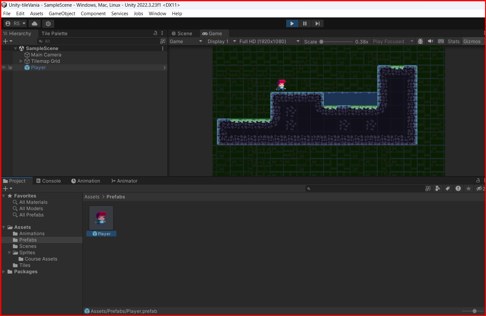

# Prefabs

Prefabs are a way to store a GameObject and its components in a reusable form. You can create a prefab from a GameObject in the scene by dragging it from the hierarchy window to the project window. You can also create a prefab by selecting the GameObject in the hierarchy window and clicking on the `Create` button in the inspector window.

Prefabs are useful for creating multiple instances of the same GameObject in the scene. You can create a prefab from a GameObject and then instantiate it multiple times in the scene. If you make changes to the prefab, all instances of the prefab in the scene will be updated, which can save you time when making changes to multiple objects.

If you made a change in one of the instances of the prefab in the scene, you can apply the changes to the prefab by selecting the instance of the prefab in the hierarchy window and clicking on the combo box called `Overrides` in the inspector window. You can then click on the `Apply All` button to apply the changes to the prefab.

## Prefab Variants

Prefab variants are a way to create variations of a prefab without affecting the original prefab. You can create a prefab variant by selecting the prefab in the project window and clicking on the `Create` button in the inspector window. You can then make changes to the prefab variant without affecting the original prefab.

Prefab variants are useful for creating variations of a prefab that share some properties with the original prefab but have different properties as well. For example, you can create a prefab variant of a character with different colors or animations.

If you make any changes to the "original" prefab, the changes **will** affect the prefab variants. You can also create multiple prefab variants from the same original prefab or from other prefab variants.

&larr; [Back to Begin](./readme.md)