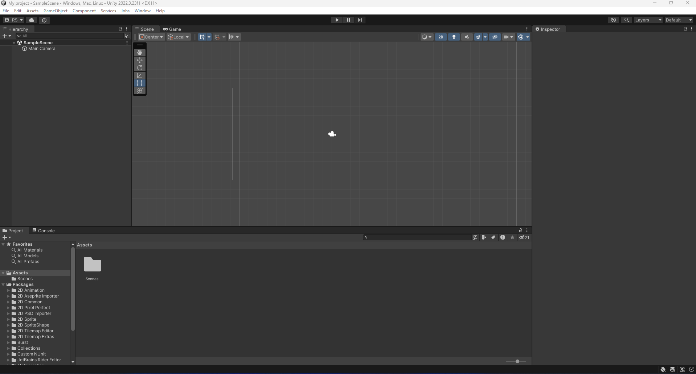
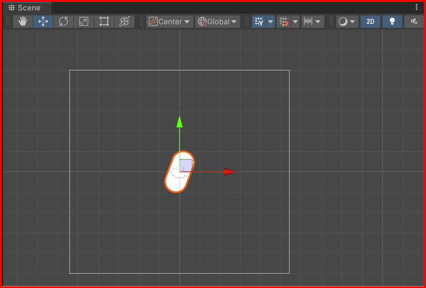
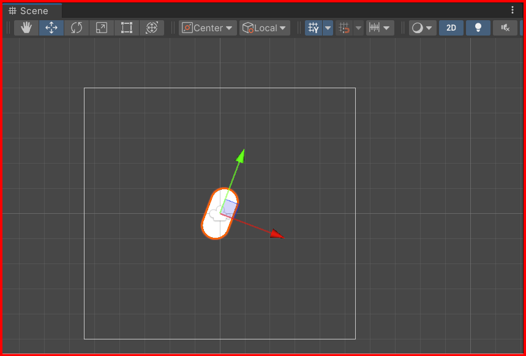
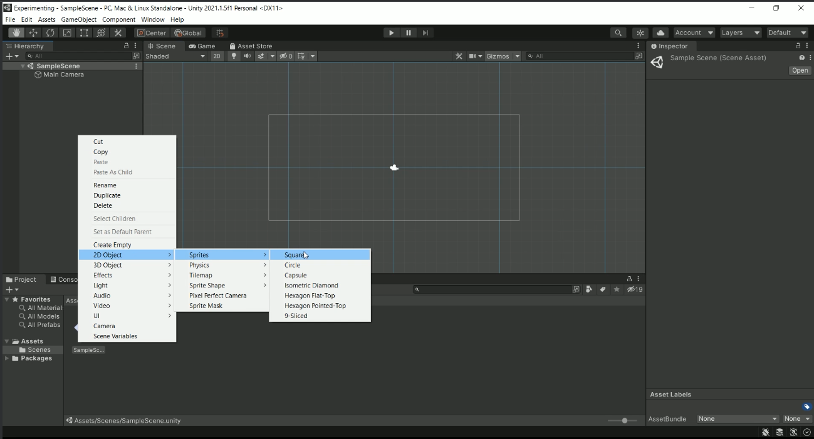
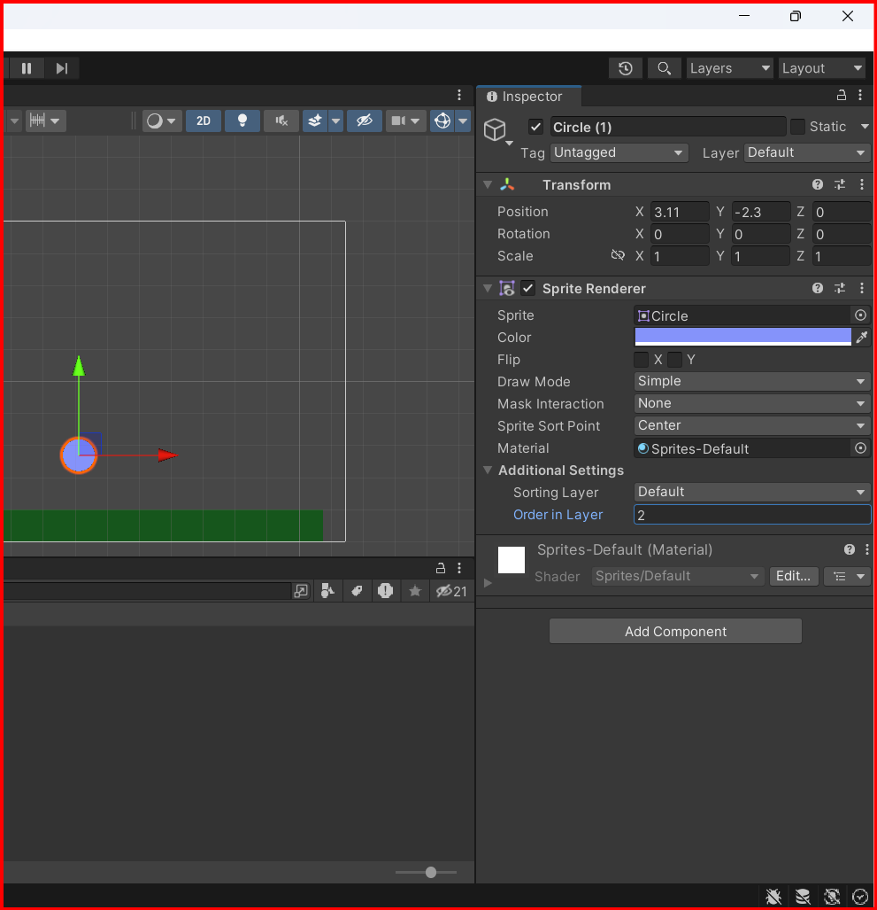

# Unity 2d course

Getting started with unity 2d game development.\
game dev tv course\
gitlab repo: https://gitlab.com/GameDevTV/unity2d-v3

- [Unity 2d course](#unity-2d-course)
  - [setup vs code](#setup-vs-code)
  - [Basics](#basics)
    - [Interface overview](#interface-overview)
    - [Basic commands](#basic-commands)
      - [Directions](#directions)
      - [Adding 2d Object(s) in scene](#adding-2d-objects-in-scene)
      - [Order in layer](#order-in-layer)
  - [Content](#content)
  - [Course Projects](#course-projects)
  - [Credits and copyrigth](#credits-and-copyrigth)

## setup vs code

1. in unity go to `edit` -> `preferences` -> `external tools`
2. set the external script editor to `visual studio code`
3. install the `C#` extension in visual studio code
4. install the `C# dev Kit` extension in visual studio code	
5. install the `unity` extension in visual studio code
6. install the `unity code snippets` extension in visual studio code

## Basics

### Interface overview

The unity editor interface 

### Basic commands

There are some basic commands that you can use to navigate in the scene view with the keyboard and mouse.

W - Select to Move the object\
E - Rotate the object\
R - Scale the object\
Q - Select the object\
T - Transform the object\
Ctrl + D - Duplicate the object

**Mouse**
Left click - Select object
Right or Middle click - Pan the scene
Middle scroll - Zoom in/out

#### Directions

The directions in unity are as follows:

- X - Red
- Y - Green
- Z - Blue

In screen space there are two buttons:
- local - the object will move in the direction of the object
- global - the object will move in the direction of the world

so if you want to move the object in the direction of the object, select the local button. If you want to move the object in the direction of the world, select the global button.

#### Adding 2d Object(s) in scene

Right click in the hierarchy window and select 2d object. You can add a sprite, tilemap, text, etc.

#### Order in layer

You can change the order in layer of the object by changing the value in the sprite renderer component. Select the object in the inspector window and change the value in the sprite renderer component.

more the number more "in front" of others object, the object will be.

## Content

[Codding in Unity](./Coding_unity.md)\
[Input System](./Input_system.md)\
[Physics](./physics.md)\
[Camera](./camera.md)\
[Custom shapes](./custom_shapes.md)\
[Sprites](./sprites.md)\
[Scenes](./scenes.md)\
[Particles](./particles.md)
[Audio](./audio.md)\
[Canvas](./canvas.md)
[Scriptable Objects](./scriptable_objects.md)\
[Tilemaps](./tilemaps.md)\
[Layers](./layers.md)\
[Animation](./animation.md)\
[Prefabs](./prefabs.md)\
[Shooting](./shooting.md)

## Course Projects

[Delivery Driver Game](https://github.com/Apostata/Unity-delivery-driver)\
[Snow Boarder Game](https://github.com/Apostata/Unity-snow-boarder)\
[Quiz Master](https://github.com/Apostata/Unity-quiz-master)\
[TileVania](https://github.com/Apostata/Unity-tileVania.git)

## Credits and copyrigth

**This is only a sumary of the course from [GameDev.tv](https://www.gamedev.tv/) at udemy plataform [UnityComplete C# Unity Game Developer 2D](https://www.udemy.com/course/unitycourse)
all rights reserved to them.**

- [GameDev.tv](https://www.gamedev.tv/)
- [UnityComplete C# Unity Game Developer 2D](https://www.udemy.com/course/unitycourse)