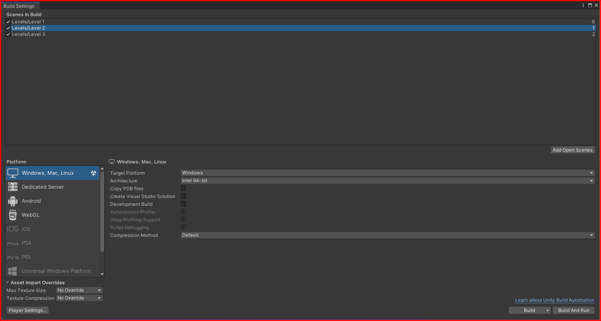

# Scenes

Scenes are the different levels or screens in the game. You can create multiple scenes in the game and switch between them. You can create a new scene by going to the file menu and selecting new scene. You can also create a new scene by pressing `Ctrl + N`.

To switch between scenes, you can use the `SceneManager` class in Unity. The `SceneManager` class is used to load, unload, and switch between scenes in Unity. You can use the `SceneManager.LoadScene` method to load a new scene. You can also use the `SceneManager.UnloadScene` method to unload a scene.

**NOTE:** You can only load scenes that are added to the build settings. To add a scene to the build settings, go to `File -> Build Settings` and click on the `Add Open Scenes` button.

## Multiple levels

You can create multiple levels in the game by creating multiple scenes. Each scene can represent a different level or screen in the game. You can switch between scenes using the `SceneManager` class.
**NOTE: Remember to add the scenes to the build settings.**

&larr; [Back to Begin](./readme.md)
