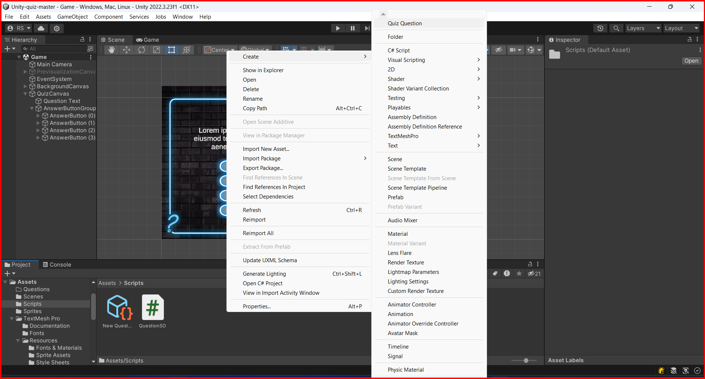

# Scriptable Objects

Scriptable objects are data containers that allow you to contain data in a way that is easy to save, reuse, and share, they are lightweight. They are used to save data that is not attached to a game object, such as settings, configurations, and other data that is not attached to a game object.
Acts as a template for creating data.

Samples uses of scriptable objects:
- weapon statistics in a RPG game
- Stora card data in a card game

## Creating a scriptable object

To create a scriptable object, you need to create a script that inherits from `ScriptableObject`. The scriptable object is created in the same way as a normal script, but it inherits from `ScriptableObject` instead of `MonoBehaviour`.

```csharp
using System.Collections;
using System.Collections.Generic;
using UnityEngine;
[[CreateAssetMenu(menuName = "Quiz Question", fileName = "New Question")]]
public class QuestionSO : ScriptableObject
{
 ...
}
```

The `CreateAssetMenu` attribute is used to create a menu item in the Unity editor to create a new instance of the scriptable object. The `menuName` parameter is the name of the menu item, and the `fileName` parameter is the name of the file that will be created when the scriptable object is created.



## Exposing scriptable objects in the inspector

To expose a scriptable object in the inspector, is the same proccess to exposing a `monoBehaviour` in the inspector. You can serialize or set to public the attibute you want to expose of the scriptable object type and assign the scriptable object to it in the inspector. see [Coding in unity](./Coding_unity.md) for more information.

Example:

```csharp
using System.Collections;
using System.Collections.Generic;
using UnityEngine;
[CreateAssetMenu(menuName = "Quiz Question", fileName = "New Question")]
public class QuestionSO : ScriptableObject
{

 [TextArea(2,6)][SerializeField] string question = "Enter new question text here";
}

```
The code above will create a menu item in the Unity editor to create a new instance of the `QuestionSO` with the name "New Question". The `question` attribute will be exposed in the inspector as a text area.
