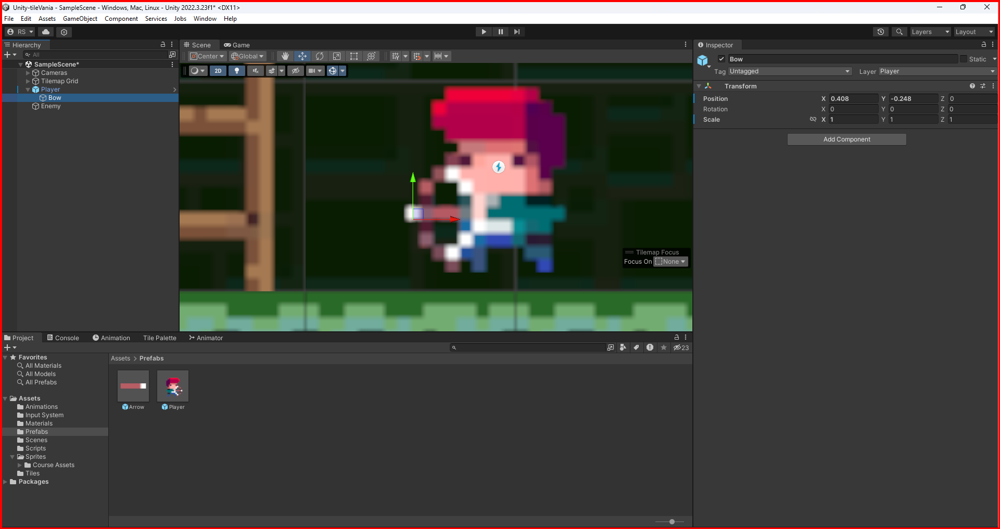

# Shooting

Let's implement a simple shooting mechanic in Unity. This will not cover the eneny or the players creation, only the shooting mechanic and the bullet(arrow in this case).

## Creating the bullet

1. let's define the position of the bullet where the players shoots.
To do this, lets add a new empty object in the player `prefab` and name it `Bow`. This object will be the position where the bullet will be created. Adjust the position of the `Bow` object to the position where the player will shoot.



2. Create a new `prefab` and name it `Arrow`. This prefab will be the bullet that the player will shoot. Add a `Sprite Renderer` component to the `Arrow` prefab and add a sprite to it. Adjust the size of the sprite to the size of the bullet.


3. Add a new `Box Collider 2D` component to the `Arrow` prefab. This will be the collider of the bullet.
4. Add a new `Rigidbody 2D` component to the `Arrow` prefab. This will be the component that will make the bullet move.
5. Create a new layer to the `Arrow` prefab and name it `Arrow`, add the `Player` sorting layer to the `Arrow` Sprite Renderer component.
6. Add a new `Arrow` script to the `Arrow` prefab. This script will be responsible for the movement of the bullet.

```csharp
using System.Collections;
using System.Collections.Generic;
using UnityEngine;

public class Arrow : MonoBehaviour
{

    Rigidbody2D arrowRigidbody;
    [SerializeField] float arrowSpeed = 5f;
    Player player;
    float playerDirection;
    float arrowDirectionSpeed =0;
    void Start()
    {
     arrowRigidbody = GetComponent<Rigidbody2D>();  
     player = FindObjectOfType<Player>(); 
     playerDirection = player.transform.localScale.x;
     transform.localScale = new Vector2(playerDirection, 1f);
     arrowDirectionSpeed = arrowSpeed * playerDirection;
    }

    void Update()
    {
        arrowRigidbody.velocity = new Vector2(arrowDirectionSpeed, arrowRigidbody.velocity.y);
    }

     void OnCollisionEnter2D(Collision2D other) {
        if(arrowRigidbody.IsTouchingLayers(LayerMask.GetMask("Enemy"))){
            Destroy(other.gameObject);
        }

        Destroy(gameObject);
    }
}

```

At the `Start` method, we get the `Rigidbody2D` component of the `Arrow` prefab and the `Player` component. We also get the direction of the player and set the direction of the arrow to the direction of the player. We also set the speed of the arrow to the to the speed of the player times the direction of the player. 

At the `Update` method, we set the velocity of the arrow to the speed of the arrow.

At the `OnCollisionEnter2D` method, we check if the arrow is touching the enemy layer. If it is, we destroy the enemy. If arrow collides with anything, including the eneny, we destroy the arrow.

7. At the player's `Input actions` asset, created when we add the `Player Input` component to the player, add a new action map and name it `Fire`(if not already there).


8. Add the `OnFire`method to the `Player` script.

```csharp
...

public class Player : MonoBehaviour
{
    ...
    [SerializeField] GameObject arrow; // the arrow prefab
    [SerializeField] Transform bow; // the bow object from the player prefab

    void OnFire (InputValue value) // occurs when the player presses the fire button, this method is comming from the input asset
    {
        if(wasHitted){ return;}
        bool fired = value.isPressed;
        if(fired){
            Instantiate(arrow, bow.position, transform.rotation);
        }
    }
}
```
The `OnFire` method is called when the player presses the fire button. If the player presses the fire button, the arrow prefab is instantiated at the position of the bow object and with the rotation of the player.

That is it for the bullet creation. Now let's implement the player shooting animation.

## Animating the player shooting

1. Create a new animation and name it `Shotting`. Add the animation to the `Player` animator controller.
2. Add a new `Trigger` parameter to the `Player` animator controller and name it `shotting`.
3. Add a transition from the `Any State`(or the state that you want) state to the `Shotting` state and set the condition to the `shotting` trigger.


4. Add the trigger to the `OnFire` method at player script.

```csharp
public class Player : MonoBehaviour
{
    ...
    [SerializeField] GameObject arrow; // the arrow prefab
    [SerializeField] Transform bow; // the bow object from the player prefab

    async void OnFire (InputValue value) // occurs when the player presses the fire button, this method is comming from the inoput
    {
        bool fired = value.isPressed;
        if(fired && !isFiring){
            playerAnimator.SetTrigger("Shoting");
            isFiring = true;
            await Task.Delay(400);
            Instantiate(arrow, bow.position, transform.rotation);
            await Task.Delay(200);
            isFiring = false;
        }
    }
}
```

At the `OnFire` method, we set the `shotting` trigger of the player animator controller. We also set the `isFiring` variable to `true` to prevent the player from shooting multiple times. We use the `Task.Delay` method to wait for part of the animation to finish and instantiate the arrow prefab. We also wait for the anination to finish, an then   variable to `false`.


&larr; [Back to Begin](./readme.md)