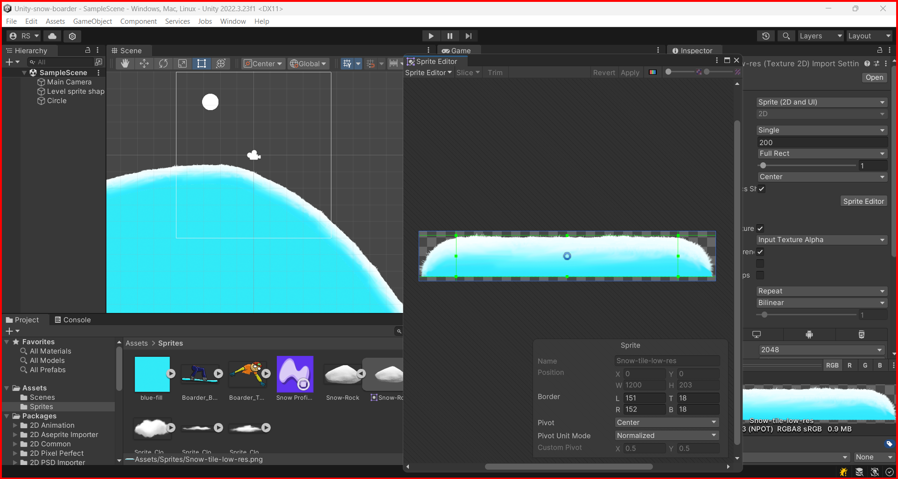
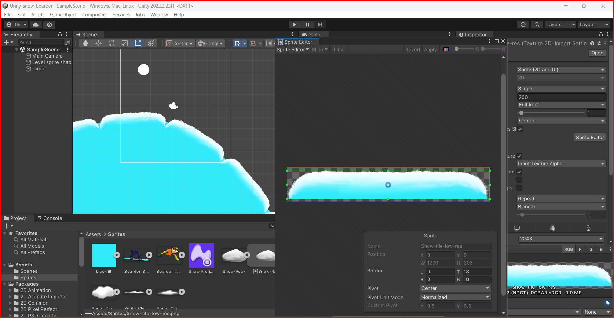
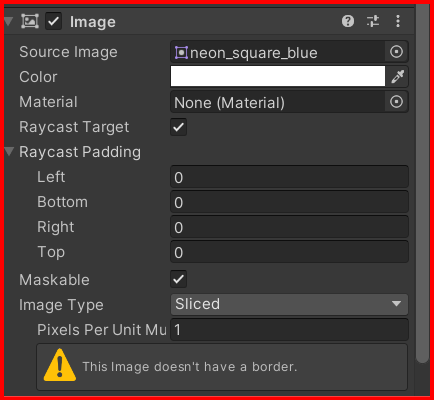
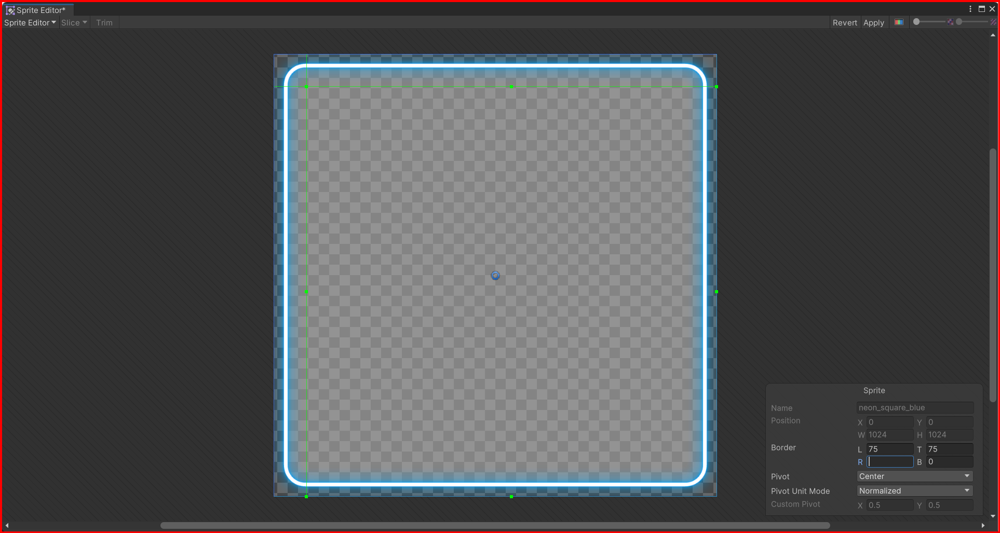
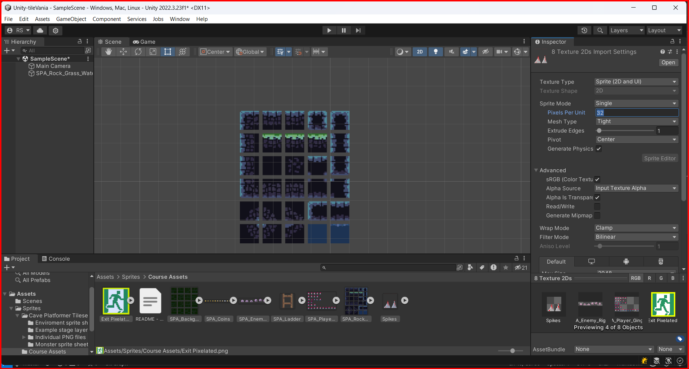
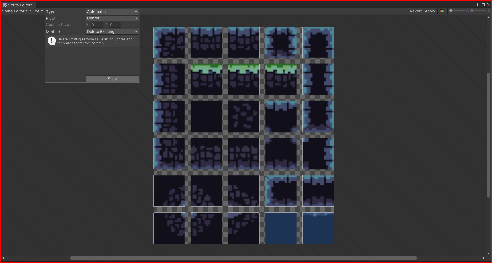
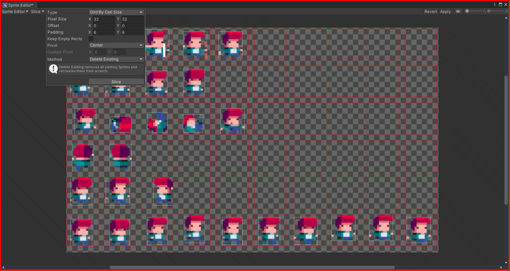
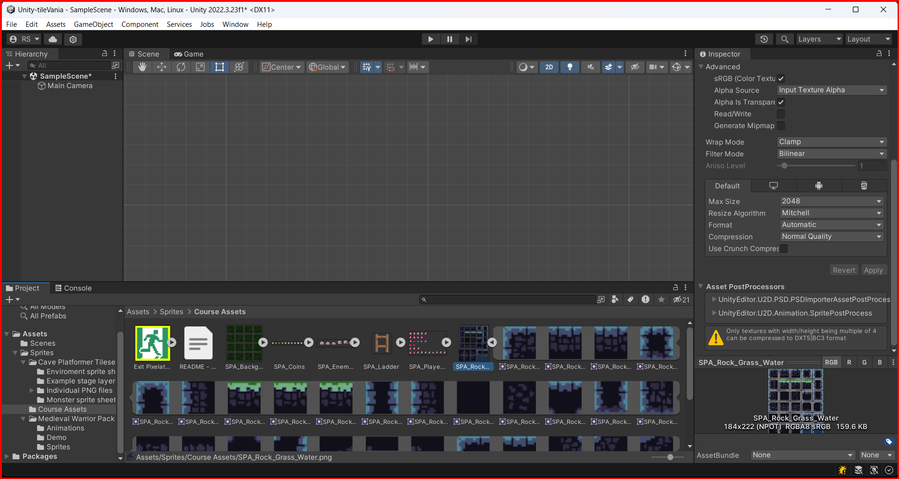

# Sprites

Sprites are 2D graphic objects used for characters, props, projectiles, and other elments in a game. They are used in 2D games to represent characters, props, projectiles, and other game objects. In Unity, you can create a sprite by importing an image file into your project and then using it in a scene. You can also create a sprite by using the Sprite Editor.

## Creating a Sprite

To create a sprite, you can import an image file into your project. To do this, right click in the assets window and select `import new asset`. Then select the image file that you want to import.

## Editing Sprites

By selecting a sprite in the assets window, you can edit the sprite shape in many ways, like pivot point, transparency, pixels per unit, etc. Also you can edit the shape of the sprite in the sprite editor.

### Sprite editor

You can customize the shape of a sprite by using the sprite editor. To open the sprite editor, select the sprite in the assets window and click on the `Sprite Editor` button in the inspector window.

In the sprite editor, you can adjust the shape of the sprite by moving the vertices of the sprite. 

## Warning - Image Without Border

If you see an warning `image without border`, 

it means that the sprite is not set up correctly. To fix this, you can adjust the sprite borders in the sprite editor. 
After you adjust the sprite borders, the warning will disappear.

## Spritesheets

Spritesheets are a collection of sprites that are combined into a single image file. Spritesheets are used to optimize the performance of a game by reducing the number of draw calls. To create a spritesheet, you can use a tool like TexturePacker or ShoeBox.

### Using Sprites in a Scene

To use a sprite in a scene, you can drag and drop the sprite from the assets window into the scene view. You can also create a new game object and attach the sprite to it.

### Slice Spritesheet

Firts, you need to defina an Unity unit size for the sprite.
What is an Unity unit size? It is the size of the tile grid in the scene view. 

Select the sprite in the project folder. Then select `multiple` in the inspector window and then click in the `apply` button at the bottom of the inspector. Then click on the `Sprite Editor` button. 

#### Types of slicing

- Grid by cell size: Slices the spritesheet into a grid of cells with a specified size.
- Grid by cell count: Slices the spritesheet into a grid of cells with a specified number of rows and columns.
- Automatic: Slices the spritesheet into cells based on the alpha values of the pixels.
- Isometric grid: Slices the spritesheet into a grid of isometric cells.

##### Slice Automatic
For an spritesheet that all the sprites have the same size, you can use the automatic slicing.

Then, in the project folder, you will see the sprite with a `play` icon. This means that this sprite is a sliced spritesheet.\
Click on the play icon to see each sprite in the spritesheet.

##### Slice Grid by cell size

If the sprites in the spritesheet have different sizes, you can use the grid by cell size slicing.

Then, in the project folder, you will see the sprite with a `play` icon. This means that this sprite is a sliced spritesheet.\

&larr; [Back to Begin](./readme.md)