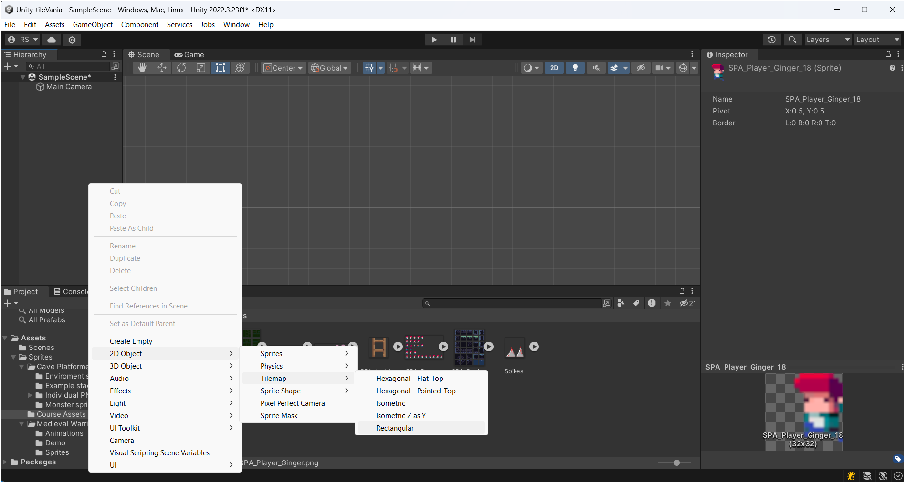
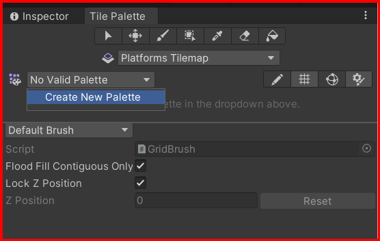
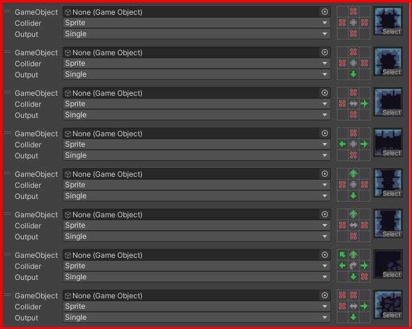
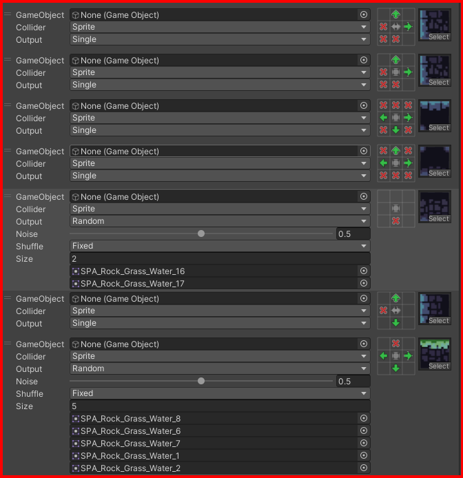
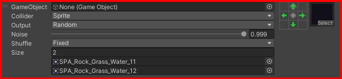

# Tilemaps

Tilemaps are a way to create 2d levels in unity. You can create a tilemap by right-clicking in the hierarchy window and selecting 2d object. You can add a tilemap object. You can also create a tilemap by selecting the grid object and adding a tilemap component.

## Adding sprites to a tilemap

To add sprites to a tilemap, you need to create a tile palette. To create a tile palette.
First create a folder called `Tiles` in the assets window.
then click on the `Window` menu, then select `2D` and then `Tile Palette`.

Then, click on the `Create New Palette` button, Name it, select the `Tiles` folder. Then, drag the sprites that you want to add to the tilemap to the tile palette.

**NOTE**: If you tilemap is not visible to the camera, make sure to reset the tilemap properties at the inspector window.

## Unity Rules Tiles

Unity has a feature called `Rule Tiles`. Rule tiles are used to create complex tile patterns. To create a rule tile, you need to create a new tile asset.

First, at the assets window and select your current `Sprites` folder, right-click and select `Create > 2D > Tiles > Rule Tile`.

In ohter words you can select a single `Tile Rule` Sprite in the Tile Palette do paint the tilemap and the rules will do quite the rest, so you can create complex tilemaps with less effort.

Example of a Rule Tile:

Explaining the Rule Tile:

- the `Red X` is the representation of the tile, telling that, in that position, for the current sprite in de middle, there is no tile.
- the `Green Arrow` is the representation of the tile, telling that, in that position, for the current sprite in de middle, must have some tile.
- When ther is no `X` or `Arrow` in the position, it means that, in that possition, the tile can be tile or no tile.

the middle icons:

- the `Circle` with arrows pointing to center, means tha is fixed, this rules, apply only for this situation.
- the `Arrows left and Right` pointing to the sides, means that the rules apply for both sides. in other words, the rules apply for the left and right side of the tile. in other words the rules are mirrored. no need to create a new sprite for the mirrored version.
- the `Arrows Top and Down` pointing to the top and bottom, means that the rules apply for the top and bottom side of the tile. in other words, the rules are mirrored. no need to create a new sprite for the mirrored version.
- the `Cross` with arrows pointing out, means that the rules apply for all sides. in other words, the rules are mirrored. no need to create a new sprite for the mirrored version.
- the `Curved Arrows` are the `rotate`, means that the rules apply for the rotated version of the tile. in other words, the rules are rotated. so the sprite in the middle is rotated, no need to create a new sprite for the rotated version.

&larr; [Back to Begin](./readme.md)